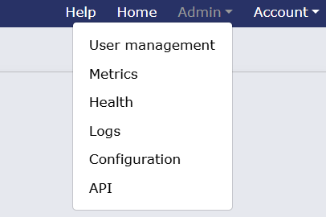
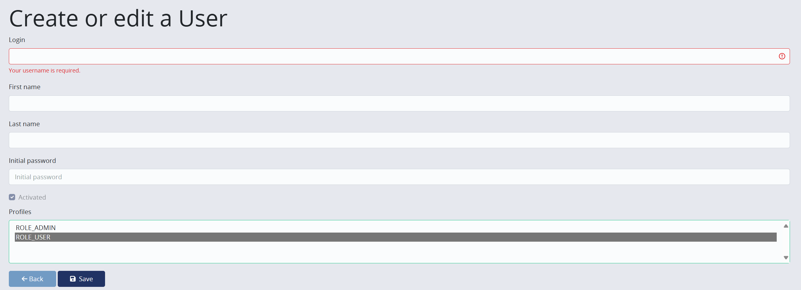
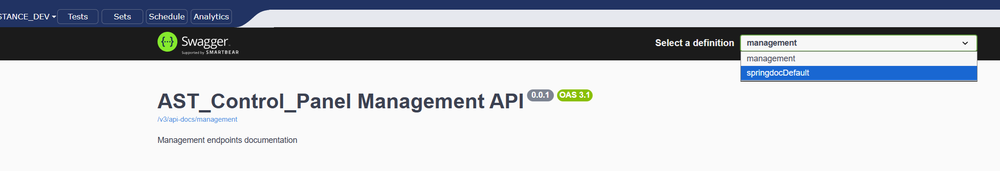

# Administration
When the admin role is assigned to a user in the AST Control Panel, they gain access to the "Admin" menu. 
This menu provides various administrative functionalities, including user management, system metrics, health status, log management, application configuration, and API documentation.

<figcaption>Admin menu dropdown</figcaption>

### User management
As an administrator, you can access the User Role Maintenance to change roles of other existing users, delete them, or create new users and assign them a password and roles .

Click admin dropdown in the upper right panel and select User management.

<figcaption>User management interface. </figcaption>

Click create a new user or use buttons next to respective user in table to change details.

<figcaption>User Role Maintenance interface. </figcaption>
This view allows an administrator to define login credentials and assign access roles (e.g., ROLE_ADMIN, ROLE_USER) for the control panel.
Each role will have access to the corresponding view.

| Role type      | Rights                                                                                                              |
|----------------|---------------------------------------------------------------------------------------------------------------------|
| **ROLE_USER**  | User can only display reports and run test cases, modify/create test cases and sets. Admin operations not available |
| **ROLE_ADMIN** | Administrative role, all right assigned                                                                             |

!!! warning "Important"
    Admin user needs to have user_role and admin_role (both) assigned as rights. So it is only user or both for administrative access.

After logging in with your user, you are navigated to landing page where you will plenty of options on [navigation panel](navigation.md), where you can access test cases and explore plenty of functionalities.

### Metrics
The Metrics tab provides an overview of the system's performance and usage statistics. 
It includes JVM metrics, HTTP request metrics, threads and other relevant performance indicators. This information can be useful for monitoring the health of the application and identifying potential issues.

### Health
The Health tab displays the current health status of the application and its components.

### Logs
The Logs tab allows you to view and manage application logs. You can set log levels (e.g., INFO, ERROR) for different package namespaces. 
This is useful for troubleshooting and monitoring the application's behavior.

### Configuration
The Configuration tab provides access to the application's configuration properties.
You can also upload and download some necessary files for the application, such as ast.properties file etc.

In the configuration files you can set up files necessary for the application:

| File                                 | Description                                                                                                                                     |
|--------------------------------------|-------------------------------------------------------------------------------------------------------------------------------------------------|
| ast.properties                       | Main configuration file for the application where you can set up various properties for the application such the avaloq connection details etc. |
| ast.license                          | License file for the application, without a valid file the tests will not execute.                                                              |
| ast.globalsettings                   | Global settings file where you can set up the business  user.                                                                                   |
| report_template_for_html_report.xslt | XSLT file used for transformation of XML report to HTML report. You can customize the HTML report by changing this file.                        |
| report_template_for_excel_report.xls | Excel template used for transformation of XML report to Excel report. You can customize the Excel report by changing this file..                |

In the application configuration section you can set up various properties:

| Property                                             | Description                                                                                                                                                                                                                                                                           |
|------------------------------------------------------|---------------------------------------------------------------------------------------------------------------------------------------------------------------------------------------------------------------------------------------------------------------------------------------|
| ast-control-panel.web.domain                         | Web domain for project.                                                                                                                                                                                                                                                               |
| ast-core.properties-file-path                        | Path to the ast.properties file if you would decide to mount it to the image. For more details on how to mount this file see [Mounting of ast.properties](deployment.md#mounting-of-astproperties-optional) section.                                                                  |
| ast-control-panel.execution.max-parallel-processes   | The number of maximum parallel processes for test execution. This is used to limit the number of parallel executions that can be run at the same time. If the number of scheduled executions exceeds this number, the additional executions will be queued until a slot is available. |
| ast-control-panel.integration.alm.enabled            | Flag to enable or disable the ALM integration. If true more options will be available in the configuration for ALM integration. For more details on ALM integration see [ALM integration](alm.md) documentation.                                                                      |
| ast-control-panel.integration.xray.enabled           | Flag to enable or disable the Xray integration. If true more options will be available in the configuration for Xray integration. For more details on Xray integration see [Xray integration](jira_xray.md) documentation.                                                            |
| ast-control-panel.user-interface.header-color        | Property to set up the color of the header in the control panel. You can use any valid CSS hex color value for this property.                                                                                                                                                         |
| ast-control-panel.user-interface.header-text-color   | Property to set up the color of the text in the header in the control panel. You can use any valid CSS hex color value for this property.                                                                                                                                             |

The override checkbox must be selected to use the value you set up, otherwise the default value will be used. Default values are set up in the application db.

### API
The API tab provides access to the REST API documentation and allows you to test API endpoints directly from the control panel.

The first APIs are the management ones. To see the solution API documentation you need to select the "springdocDefault" option from the dropdown:
