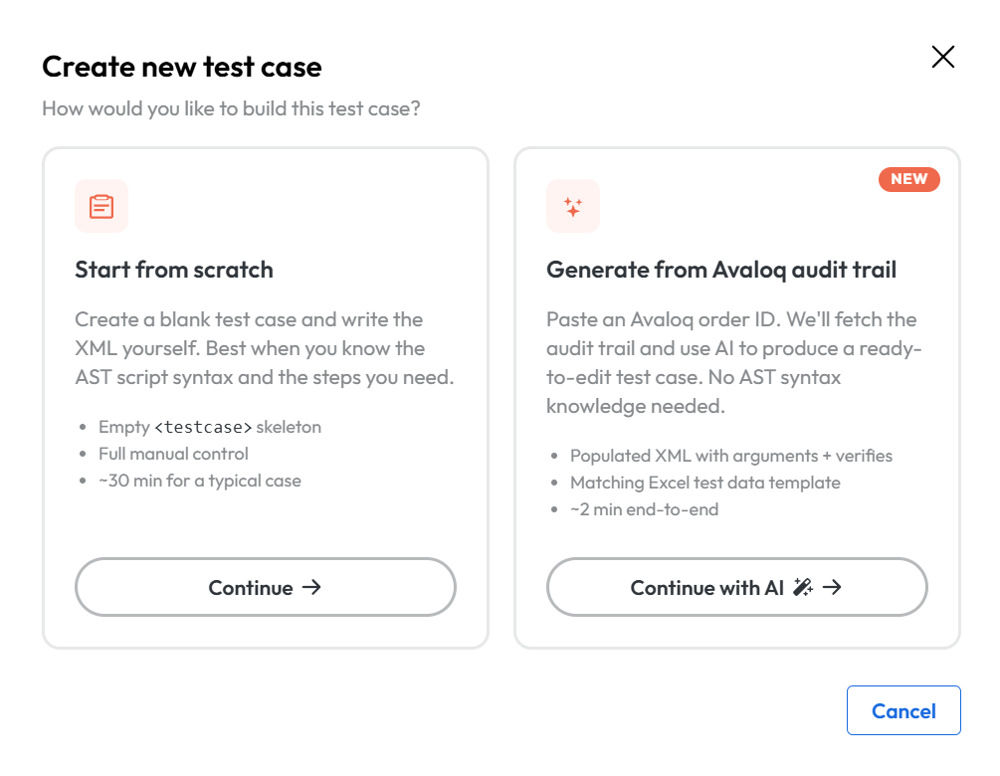
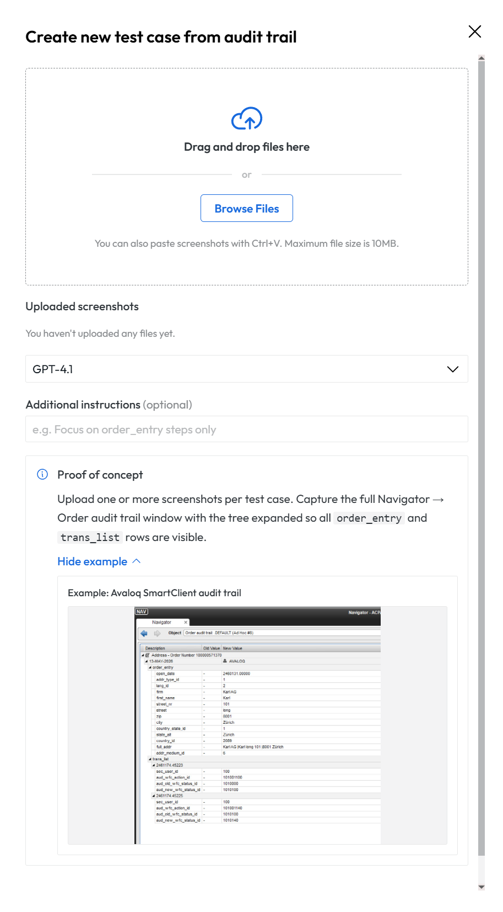
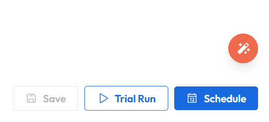

# AI Integration

## Enabling the feature

To enable the feature you need to activate the spring boot profiles: prod, api-docs and ai-integration.
Using the environment variable:
```properties
SPRING_PROFILES_ACTIVE=prod,api-docs,ai-integration
```
More information how to set up environment variables can be found in the [Setting up environment variables](deployment.md#setting-up-environment-variables) section.

To run this profile correctly more environment variables need to be set:
```properties
AST_CONTROL_PANEL_INTEGRATION_FASTAPI_CHAT_URL=https://url-to-keystone.com

```

| Property                                             | Description                                                          |
|------------------------------------------------------|----------------------------------------------------------------------|
| AST_CONTROL_PANEL_INTEGRATION_FASTAPI_CHAT_URL       | URL of the AI service endpoint                                       |

## Changes to application behavior

After the activation of the AI profile there are only a handful of changes to the UI.

The most prominent is the new modal when creating a testcase. Here you can choose between the classic way or create the testcase via AI.



<figcaption>The create new test case dialog showing two options of creating a testcase</figcaption>

After clicking on the `Continue with AI` button another dialog is shown.
In this dialog you are able to upload the screenshot of the audit trail from your computer.
You can choose different AI models and also an example audit trail is shown.


<figcaption>Dialog for uploading of the audit trail screenshot.</figcaption>

After pressing the create button the screenshot will be sent to the AI and a loading icon is displayed. During this time you have to wait for the generation to complete.
After the generation is over the testcase will be shown in the `Tests` view.
The testcase will be open at creation.

Another change in the UI is the AI assistant button which is present at the bottom right of every open testcase.
Further modification of the testcase can be made via a chat with the AI.


<figcaption>The AI assistant icon.</figcaption>

