This chapter provides instructions for integrating HP ALM with the AST Control Panel. You will learn the necessary configuration steps, how to link test cases to external ALM IDs, map ALM instance IDs, and view the synchronization status for executed tests.

### ALM Configuration

To enable HP ALM integration, an administrator must navigate to the configuration panel in the AST Control Panel and perform the following steps:

1. **Enable Integration**: Ensure that `ast-control-panel.integration.alm.enabled` is set to `true`.
2.
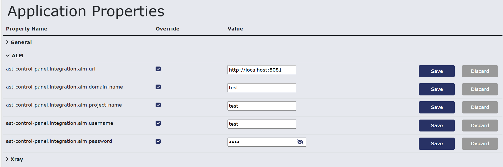
<figcaption>Application Properties in AST Control Panel showing the <code>ast-control-panel.integration.alm.enabled</code> setting activated for ALM integration.</figcaption>

2. **Enter Connection Details**: Input the required ALM configuration parameters, including the **URL**, **domain**, **project name**, **username**, and **password** .
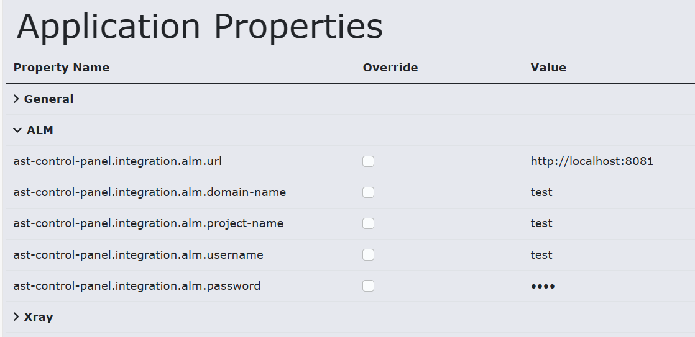
<figcaption>Interface for entering ALM configuration parameters, such as URL, domain, project name, username, and password, to establish the connection.</figcaption>

!!! info
    When setting the URL use the URL without the qcbin part.

#### Setting Environment Variables(Optional)
The ALM session and login(authentication) endpoint can be changed by setting the environment variables `AST_CONTROL_PANEL_ALM_SESSION_ENDPOINT` and `AST_CONTROL_PANEL_ALM_LOGIN_ENDPOINT`. 

By default, the session endpoint is set to `/qcbin/rest/site-session` and the login endpoint is set to `/qcbin/authentication-point/alm-authenticate`. 

If your ALM instance uses different endpoints, you can set these environment variables accordingly.
On how to set environment variables please refer to the [Setting environment variables](deployment.md#setting-up-environment-variables) documentation.

### Assigning External ALM IDs to Test Cases

To link AST test cases to corresponding test entities in HP ALM, you must assign an External HP ALM ID.

1. **Individual Assignment:**
    - Go to the 'Tests' tab and click on a specific test case.
    - The test case details view will open, showing a field where you can assign or edit the 'External HP ALM ID').

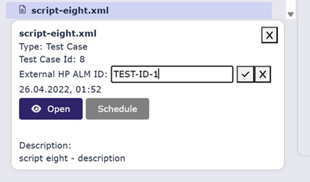
<figcaption>Test Case details view showing the field for assigning or editing the 'External HP ALM ID' to link the script to a corresponding ALM entity.</figcaption>

2. **Bulk Assignment (CSV Upload):**
    - Right-click on a test case in the repository tree to open the context menu.
    - Select 'Manage External IDs'.
    - This opens a dialog allowing you to upload the mappings via a CSV file. The CSV file must contain the AST Test Case ID, the External Hp Alm ID, and optionally, ALM Instance Ids.

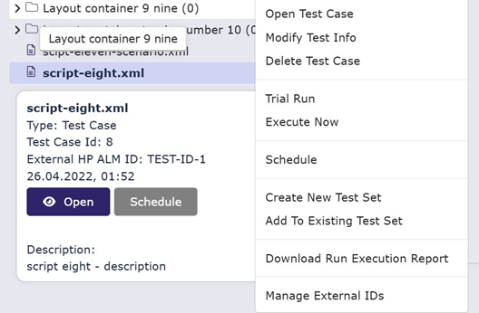
<figcaption> Test case context menu displaying the 'Manage External IDs' option for bulk upload of ID mappings via CSV.</figcaption>

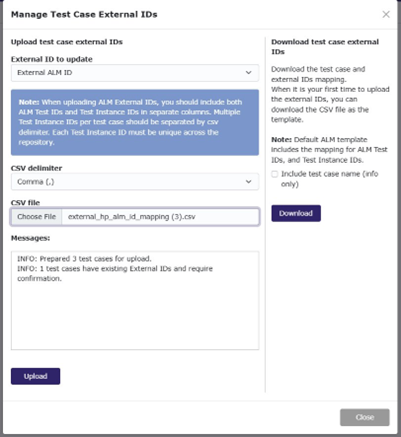
<figcaption>Dialog box for uploading external IDs via CSV file, showing fields for the file and a download button for the CSV template.</figcaption>

Sample CSV upload:
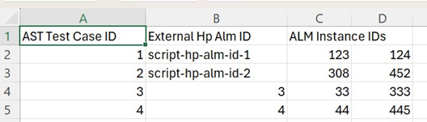
<figcaption>Sample content of the CSV template showing columns for AST Test Case ID, External HP ALM ID (e.g., <code>script-hp-alm-id-1</code>), and ALM Instance Ids.</figcaption>

### Assigning ALM Instance IDs in Test Sets

When executing tests in HP ALM, the synchronization requires an External ALM Instance Id to be associated with each test case within a Test Set.

1. Go to the 'Sets' tab.
2. Select a Test Set and navigate to the 'Definitions' section.
3. Each listed test case must have a valid 'External ALM Instance Id' assigned.
4. If a test case is missing this ID, you cannot schedule a synchronization with ALM. The ID can be assigned via a dropdown menu or added as a new entry.

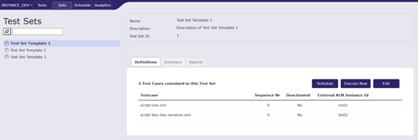
<figcaption>Test Set Definitions view listing test cases and showing the requirement for an 'External ALM Instance Id' for ALM synchronization..</figcaption>>

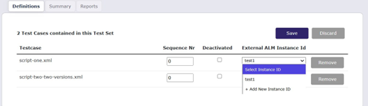
<figcaption>Detail view of a test set showing the dropdown menu for assigning or adding a new 'External ALM Instance Id' for each test case.</figcaption>
 

### Scheduling and ALM Synchronization

Once your test cases are linked to ALM IDs and organized in a Test Set, you can schedule the run and initiate the synchronization process.

1. **Schedule the Run**: When scheduling a test run (either immediately or for a future time), ensure the ALM sync checkbox is selected in the scheduling dialog

Schedule execution dialog with the ALM sync checkbox selected, indicating that execution results will be synchronized with HP ALM.

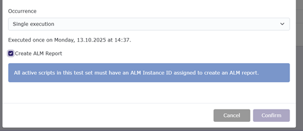
<figcaption>Image of the Schedule Execution dialog showing a checkbox for ALM sync.</figcaption>

2. **Monitor Synchronization**: After execution, the results and the synchronization status will be visible in the 'Schedule'

Schedule view displaying a history of test runs, including columns for overall execution status and ALM sync status.

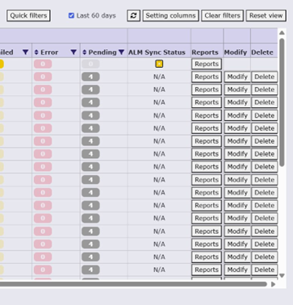
<figcaption>Image of the Schedule view table showing execution status and ALM Sync Status columns</figcaption>

3. **View Sync Logs**:Clicking on the 'Reports' button for a completed execution opens a detailed view, which includes execution status and ALM sync logs
   
Detailed execution report with a link to the ALM Sync Log, providing information on the synchronization outcome.</figcaption>

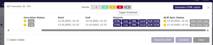
<figcaption>Image of the detailed execution report showing links to HTML, Log, and XML reports, along with an ALM Sync Log link.</figcaption>

4. **Detailed Logs and Errors**: Detailed logs, including the time, status, and any errors from the synchronization attempt, can be viewed in the log window

Panel in the detailed execution report showing the ALM Sync Logs with timestamps, status, and any troubleshooting information.

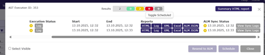
<figcaption>Image of the detailed execution report showing a panel with ALM Sync Logs and status indicators</figcaption>

### Sync Failures and Troubleshooting

If a synchronization fails, the AST Control Panel provides tools for troubleshooting and retrying the sync.

1. **Failure Icon**: A failure icon will appear in the ALM Sync Status column for any failed synchronization.
2. **View Error Details**: Clicking the 'Log' button provides the error details for the failed sync.

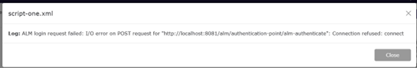
<figcaption>Image of the Sync Failure Log window showing an error message</figcaption>

3. **Download JSON Payload**: You can click the 'ALM JSON' button to download the raw JSON payload that was sent to ALM. This file can be used for manual upload or debugging the data structure.

<figcaption>Image of the detailed execution report panel showing the 'ALM JSON' button</figcaption>

4. **Resend to ALM**: To retry the synchronization after resolving the issue, select the failed test(s) and click the 'Resend to ALM' button.
   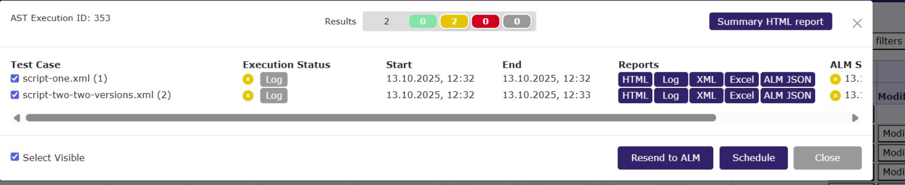
<figcaption>Schedule view showing the 'Resend to ALM' button for retrying a failed sync</figcaption>

Below is an example of a JSON payload sent to ALM:

~~~JSON
{
  "Type": "run",
  "Fields": [
    {"values": [{"value": "Test Import from AST"}], "Name": "name"},
    {"values": [{"value": "admin"}], "Name": "owner"},
    {"values": [{"value": "sript-hp-alm-id-1"}], "Name": "test-id"},
    {"values": [{"value": "test1"}], "Name": "testcycl-id"},
    {"values": [{"value": "Failed"}], "Name": "status"},
    {"values": [{"value": "hp.qc.run.MANUAL"}], "Name": "subtype-id"},
    {"values": [{"value": "2025-10-13"}], "Name": "execution-date"},
    {"values": [{"value": "12:32:59"}], "Name": "execution-time"}
  ]
}
~~~

