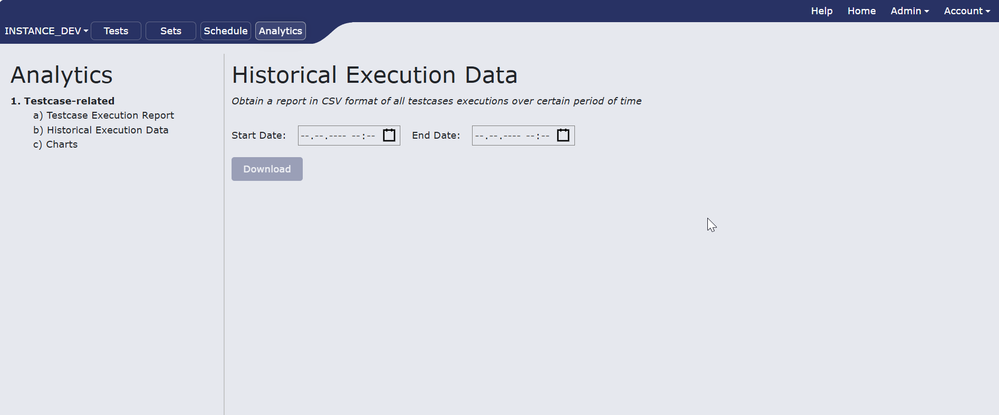
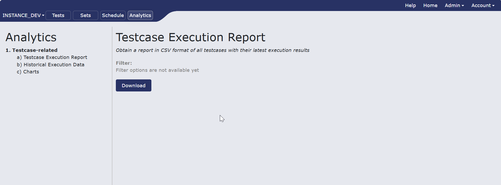

# Analytics
The "Analytics" menu provides access to reporting functionalities.

The structure is based on a navigation pane on the left and a content area on the right.

The left navigation pane categorizes the available reports. Currently, the primary category is "1. Testcase-related," under which the specific report option is listed.

## Execution Reporting

After a test case has been executed, a user can access its detailed report.
This report offers three different viewing formats to accommodate various user needs and external tools: HTML for a user-friendly, web-based view; Log for a detailed, step-by-step text record; and XML for a structured data format suitable for parsing by other applications. This flexibility ensures that the results can be easily reviewed and integrated into other systems.

### Reports to download

**1.Historical execution data**
Select the date you want to recieve data from and click download. Report in csv format will be donwloaded to you machine

<figcaption></figcaption>

**2.Testcase execution report**
To obtain a report in CSV format of all testcases with their latest execution results, click download.

<figcaption></figcaption>