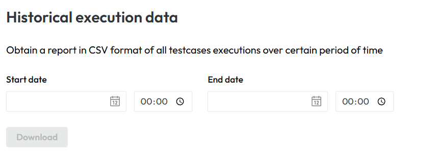
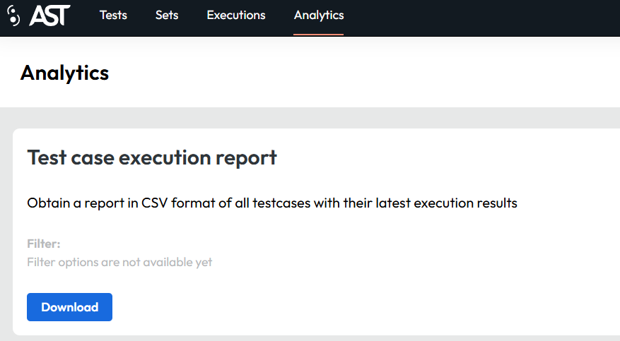

# Analytics
The "Analytics" menu provides access to reporting functionalities.

The structure is based on a navigation pane on the left and a content area on the right.

The left navigation pane categorizes the available reports. Currently, the primary category is "1. Testcase-related," under which the specific report option is listed.

## Execution Reporting

To learn more about the execution reporting features, refer to the [Reports](reports.md) documentation.

### Reports to download

**1.Historical execution data**
Select the date you want to receive data from and click download. Report in csv format will be downloaded to your machine

<figcaption></figcaption>

**2.Testcase execution report**
To obtain a report in CSV format of all testcases with their latest execution results, click download.

<figcaption></figcaption>