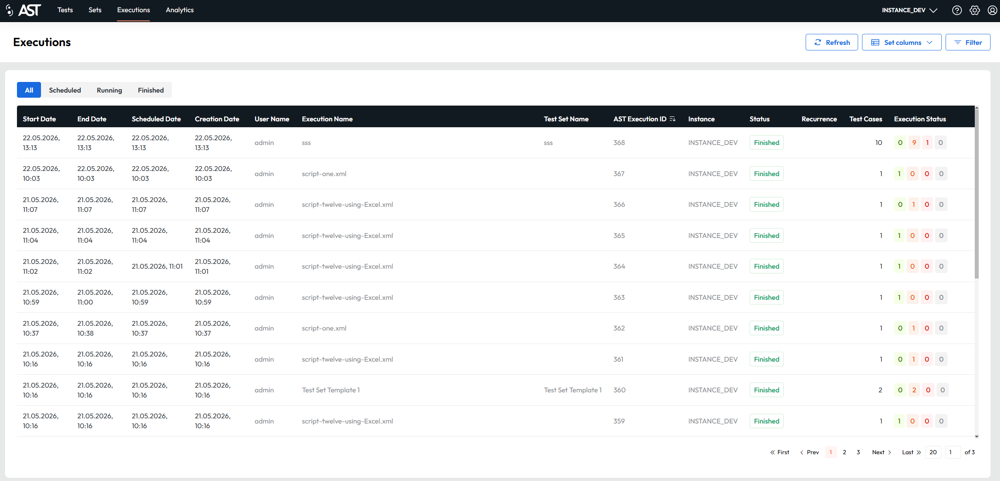
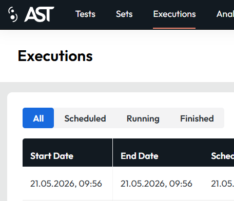
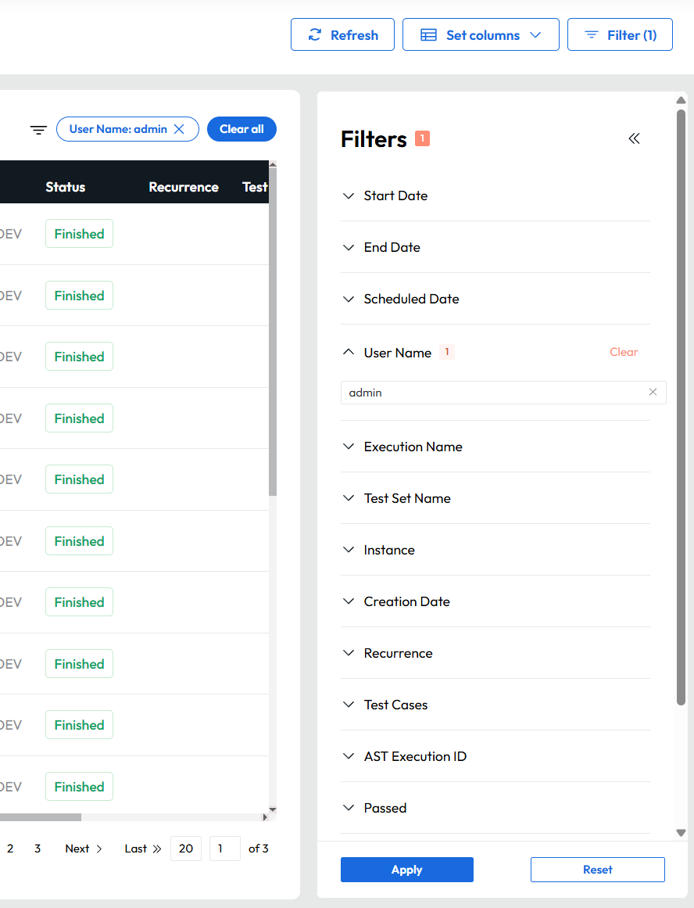
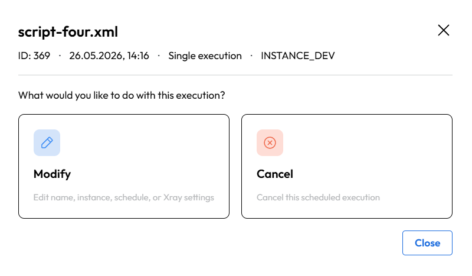

# Executions

Executions tab contains all scheduled runs, executed runs and currently executed runs with all their details. 
It is the main place to monitor and manage test execution.

<figcaption>Schedule tab view: table with all runs</figcaption>

**List of columns with explanations**

| Column           | Description                                               |
|------------------|-----------------------------------------------------------|
| Start date       | Starting date of a run                                    |
| End date         | Ending date of a run                                      |
| Scheduled date   | Scheduled date of a run                                   |
| Creation date    | Creation date of a run                                    |
| User name        | User name that created the set / test case                |
| Execution name   | Name of the execution                                     |
| Test set name    | Name of the set being executed                            |
| Instance         | Avaloq instance where tests are executed                  |
| Status           | Status of the execution(Schedilend/Running/Finished)      |
| Recurrence       | Recurrence of this run                                    |
| Test cases       | Number of test cases                                      |
| AST execution ID | Id of the execution                                       |
| External Xray    | Id used for Xray sync                                     |
| Execution status | Number of passed/Failed/Error/Pending tests from test set |
| Xray sync status | Displays the success/fail of the sync to xray             |
| ALM sync status  | Displays the success/fail of the sync to alm              |

### Table view customization

This table can be altered by adding or removing mentioned columns via clicking  the 'Set columns' button. This will open a pop-up with all columns to be selected or unselected as checkboxes. 
The table can be set to its default view by clicking on 'reset view' button.

Columns can also be pinned to the left side of the table by clicking on the pin icon in the 'Set columns' dropdown. 
This will make sure that the column is always visible when scrolling horizontally through the table. 
You can unpin the column by clicking on the pin icon again.
The order of the pinned columns is determined by the order in which they were pinned, meaning that the first column you pin will be the leftmost one, and the last column you pin will be the rightmost one among the pinned columns.

<figcaption>Set columns with all columns to be selected or unselected as checkboxes. 
The Start date columns has the grey pin next to it which indicates it is pinned.
The End Date column is not pinned so you can see an outline of a pin as it being hovered.</figcaption>

### Ordering
Ordering of the data in a column can be changed by clicking on the column header.
This will order the data in descending order. Another click on the same column header will order the data in ascending order.
To cancel the ordering, click on the column header again.

Ordering is applied after filtering, meaning that if you have some filters applied, the ordering will be applied only to the filtered data.

### Filtering

The first type of filter is the quick filter which allows you to filter by execution status e.g. Scheduled, Running and Finished executions.
This filter is located on the top left side of the table.

<figcaption>Image of the execution status filter</figcaption>

Other option to filter is by clicking the "Filter" button on the top right side of the table which will open a collapsible panel with more filtering options.
In selected filters the app offers suggestions for filters e.g. user name. 
If a filter is active it will be shown in the active filters tab on the top right side of the table.
You can quickly clear the filters by clicking on the "x" icon next to the active filter or by clicking on the "Clear all" button which will clear all active filters at once.

!!! warning Important
    The for execution status is applied together with other filters, meaning that if you select "Scheduled" status and filter by user name "John", you will see only scheduled executions created by John. 
    If you want to see all executions by "John", you need to set the execution status filter to "all".

<figcaption>Filter tab with selected user name filter and active filters tab.</figcaption>

### Execution details

Clicking a table row of a Running or Finished execution button will show the same functionality as shown in the Test set [reports tab](test_sets.md#reports-tab).

When clicking a table orw of a Scheduled execution a dialog will be shown that gives you the option to modify or cancel the scheduled execution.

<figcaption>Dialog shown when clicking on a Scheduled execution</figcaption>

If you select modify option, you will be navigated to another dialog where you can change the execution name, avaloq instance and scheduled date and time.

If you select cancel option, a confirmation dialog will be shown to confirm the cancellation of the scheduled execution. After confirming, the execution will be cancelled and removed from the table.
