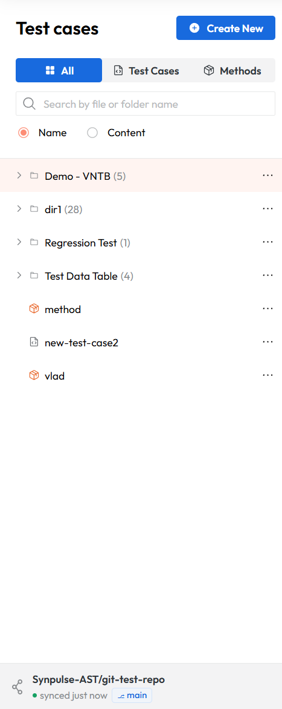
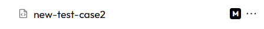
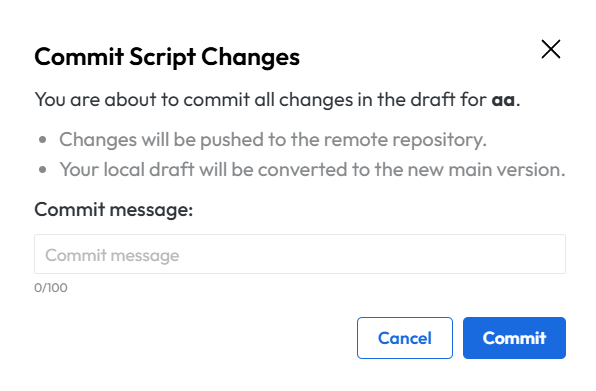
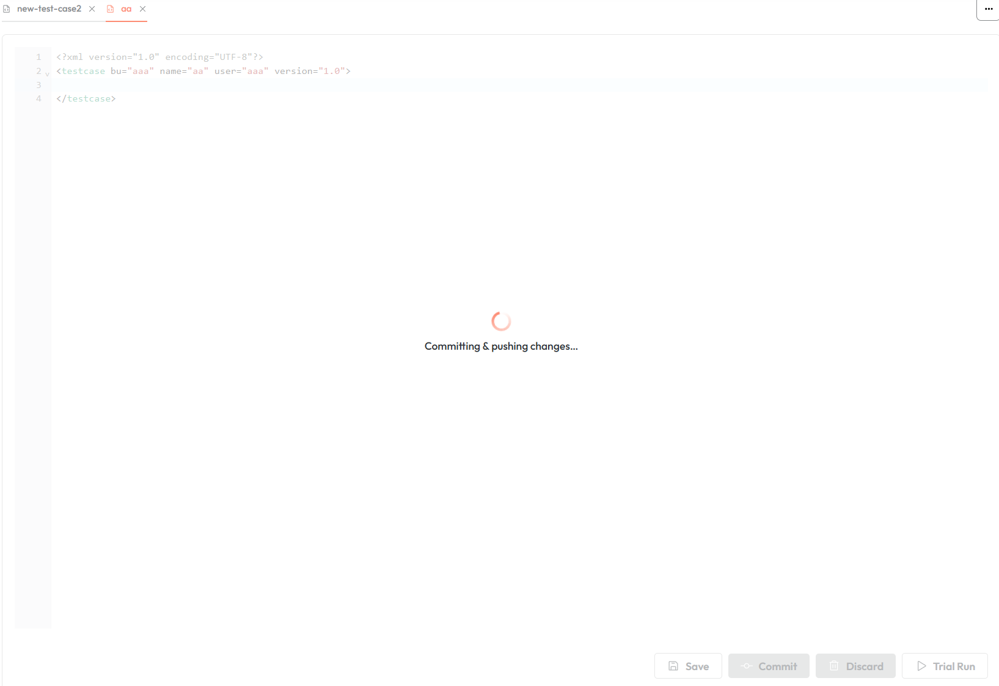

# Git (experimental)

!!! Warning
    This feature is in an experimental phase. If you decide to use it please make backups before you activate the feature.
    We strongly advise to use it on development environments or environments that are not critical for your daily operations.

## Enabling the feature

To enable the feature you need to activate the spring boot profiles: prod, api-docs and git-integration. 
Using the environment variable:
```properties
SPRING_PROFILES_ACTIVE=prod,api-docs,git-integration
```
More information how to set up environment variables can be found in the [Setting up environment variables](deployment.md#setting-up-environment-variables) section.

To run this profile correctly more environment variables need to be set:
```properties
AST_CONTROL_PANEL_GIT_REPO_URL=https://github.com/your-repository.git
AST_CONTROL_PANEL_GIT_BRANCH_NAME=master
AST_CONTROL_PANEL_GIT_ACCESS_TOKEN=personal-access-token
```

| Property                                             | Description                                                                       |
|------------------------------------------------------|-----------------------------------------------------------------------------------|
| AST_CONTROL_PANEL_GIT_REPO_URL                       | Url of the repository which will be cloned                                        |
| AST_CONTROL_PANEL_GIT_BRANCH_NAME                    | Branch which will be cloned                                                       |
| AST_CONTROL_PANEL_GIT_ACCESS_TOKEN                   | Access token used to access repository. It has to be a Personal Access Token      |

We advise to store the access token as a secret. We also advise using a technical user for the token.
More information how to set up secrets can be found in the [Setting up environment variables](deployment.md#setting-up-environment-variables) section.

## Changes to application behavior

After the activation of the git profile there are several changes to the application UI. 
The side panel now contains the repository, branch and last sync indicator in the bottom of the sidebar.
The application pulls changes from the remote repository every 2 minutes.


<figcaption>The git indicator visible at the bottom of the sidebar</figcaption>

When the git integration is active, the configured branch serves as the single source of truth for the test case repository. 
The application's local state is synchronized from this branch.

!!! info
    If you have existing test cases created in non-git mode, they will remain in the database but will not be displayed in the application. 
    Only test cases present on the configured branch will be shown. 
    If you disable the git integration later, the previously stored test cases will become visible again.

### Testcase drafts

Every modification or creation of a test case will firstly create a draft. 
Drafts are user specific, meaning each user has their independent drafts.
A draft of a testcase is a file stored on the disk that was not yet committed/pushed to the git repository.
Drafts can be used in trial runs but cannot be scheduled for normal execution. You first need to commit/push the draft to the git repository.

Testcases that are a draft have an 'M' badge next to their name. 


<figcaption>Example of the modified badge </figcaption>

### Committing/Pushing a testcase to git

When a testcase is a draft the user can choose between committing/pushing or discarding the draft. 
When the user opens a testcase in the bottom part, the 'Commit' and 'Discard' buttons are present. 

After clicking on the 'Commit' button a dialog is visible which enables you to add a commit message.


<figcaption>Example of the commit dialog </figcaption>

During a testcase commit and push the UI for that testcase is disabled as can be seen in the screenshot below, but the user
can switch to other testcases seamlessly.


<figcaption>Example of blocked UI during commit/push </figcaption>

In git, the commit shows which AST user pushed the change.

Discarding a draft testcase deletes the user's draft and restores the testcase to the last committed version.
For newly created testcases discard will remove the testcase entirely.

### Constraints when using git integration

When using the app with the git profile active there are several constraints to take into consideration.

| Action           | Via AST CP          | Via Git |
|------------------|---------------------|---------|
| Create test case | Yes (as draft)      | Yes     |
| Create method    | No                  | Yes     |
| Create folder    | No                  | Yes     |
| Modify test case | Yes (creates draft) | Yes     |
| Modify method    | Yes (creates draft) | Yes     |
| Modify folder    | No                  | Yes     |
| Delete any       | No                  | Yes     |
| Upload test data | Yes                 | No      |

Changing testcases into methods and vice versa is not advised as the application may not correctly track the file type change.
Instead, create a new file of the desired type and delete the original via git.
