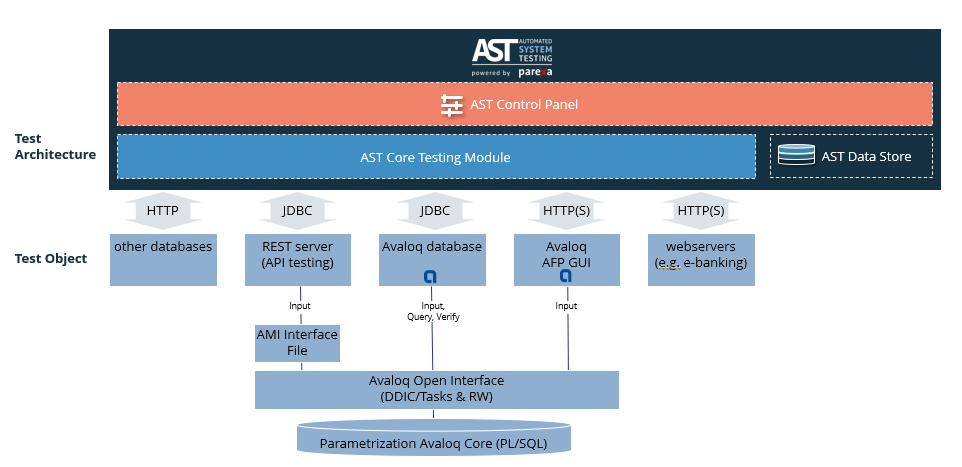
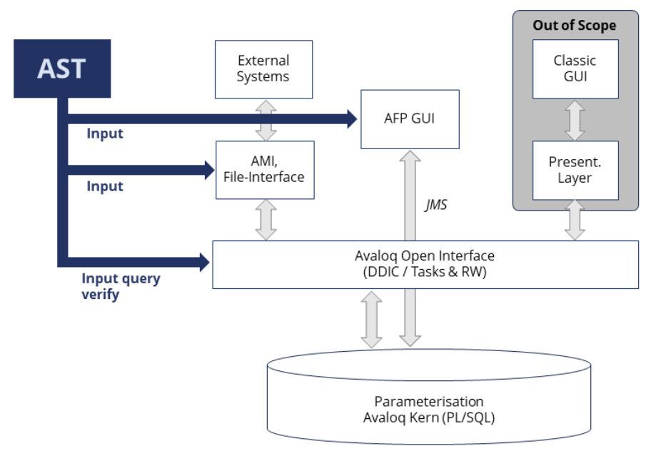
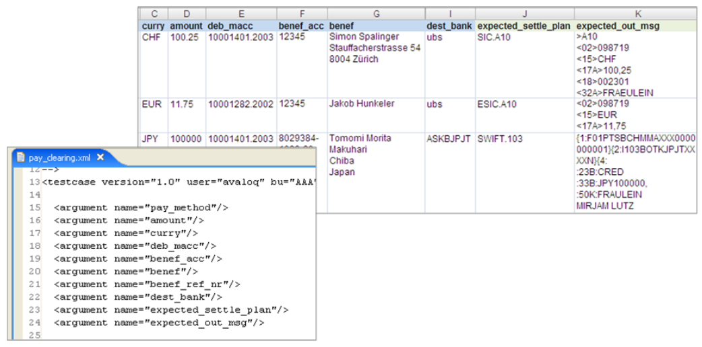
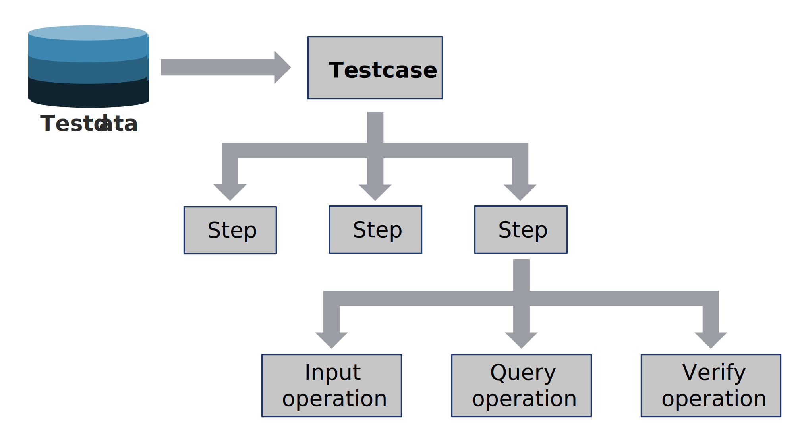
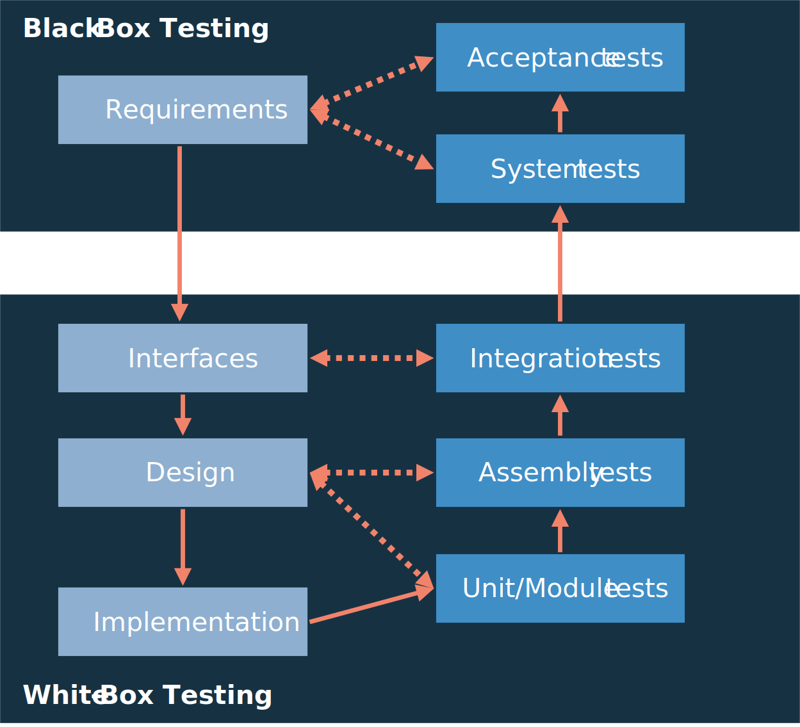

# Introduction

## Automated System Testing (AST) Tool
The **Automated System Testing (AST)** Tool is a platform-independent, standalone Java application for **test automation** within the Avaloq Banking System. It facilitates testing of both **functional and non-functional** aspects across all test stages, including unit, assembly, and system tests.

### Separation of Test Data and Logic

AST employs a core principle of separating test data from test logic to enhance flexibility and streamline the testing process:

- **Test Data** is defined by business users within **Excel files**
- **Test Logic** is defined by Avaloq specialists using a simple **XML-based test script syntax**

### Operation Capabilities

AST connects to the Avaloq Banking System via the **Avaloq Open Interface (DDIC, Report Writer, AMI)** and provides a range of operations to automate testing:

- **Order and File Management**: Create and process orders and files with full access to the Avaloq order workflow engine.
- **Object and Message Handling**: Search for and manage various Avaloq objects and messages.
- **Scripting**: Execute arbitrary blocks of Avaloq Script and JavaScript within your test cases.

### Reporting and Analysis

AST supports comprehensive analysis and reporting for test campaigns:

- **Reporting**: Generates reports in multiple formats, including XML, HTML, and Excel.
- **Readiness Check**: A readiness check is performed and reported at the beginning of each test run.

### AST Suite Components
The AST Testing Suite comprises two main components: the **AST Core (execution engine)** and the **AST Control Panel (management interface)**.

#### AST Core

The **AST Core** is the test execution engine. Its function is to run test cases, verify the results, and generate the corresponding reports. It supports various operations, including input, query, and verification steps, and integrates with Avaloq using the Open Interface (DDIC, Report Writer, AMI).

#### AST Control Panel
High-level architectural overview of the AST Suite, illustrating core components and their interaction with target systems via the Avaloq Open Interface for all testing operations.</figcaption>

<figcaption>Diagram of AST's core components (Control Panel, Core Testing Module) connecting to databases and web servers via HTTP and JDBC.</figcaption>

The AST Control Panel is a web interface for test management. Its functionality includes:

- Managing test cases.
- Scheduling test executions.
- Viewing analytics.
- Administering user access.

!!! info
    This panel simplifies the creation and organization of test sets and provides visual access to execution reports and system health.

## AST Architecture and Testing Features

AST system integration architecture. AST utilizes the Avaloq Open Interface and specific channels (AMI, AFP GUI) to ensure comprehensive testing access to the core parameterization layer.

<figcaption>Architecture diagram showing how the AST tool integrates with the Avaloq core via the Open Interface (DDIC, Tasks & RW) to test external systems, files, and the AFP GUI.</figcaption>

The architecture of AST follows the design of the Avaloq Banking System. AST uses the officially supported Avaloq Open Interface to process user-driven testcases. That gives AST testing scripts access to the full functionality of the Avaloq Banking System.

!!! info
    The test universe/environment is always the whole system, including the Avaloq core functionality and the client's parameterization. In general, the AST system architecture is designed to automatically test every possible business case the Avaloq Banking System supports.

### Testing functionalities

AST provides functionality to automate testing for the Avaloq Banking System, and offers operation in the following areas:

| Area | Description |
|---|-----|
|Order Management| <ul><li> Creation and processing of orders (full access to all aspects of the Avaloq order workflow engine, respecting security roles and restrictions)</li><li> Searching of orders, and access to all order attributes.</li></ul>|
| Object Management | <ul> <li>Searching of objects (respecting security roles and restrictions)</li> <li> Access to all attributes of objects.</li></ul>|
|File Processing|<ul><li>Uploading, processing of files (Avaloq standard formats and user defined types).</li><li>Full access to all results of the processed file.</li></ul>|
|Message Processing|<ul><li>Insertion and processing of any message (standard and user defined types)</li><li>Access to all results of message processing</li><li>Access to all aspects of outgoing messages (with tag-based verification for SIC, EuroSIC, SWIFT and SECOM messages)</li></ul>|
|Application Management|<ul><li>Conditional execution of test steps</li><li>Execution of an arbitrary Avaloq script block</li><li>Execution of Tasks</li><li>Tests are always executed under a freely definable user (any security aspects are respected). Security settings (user) can be switched even within a test case.</li><li>Readiness test: Access to system parameters so that the availability of the system can be analyzed before the test run.</li></ul>|
|AFP Interface Testing|<ul><li>Test interaction with the Avaloq web interface works as expected.</li><li>Start testcase in AFP and finish in Avaloq backend or viceversa.</li></ul>|

### Testing Logic and Test Data

AST offers to separate **test logic** (test scripts) and **test data** (business data) to enhance efficiency and reduce coding effort. Therefore, the AST test dataset is defined, edited, and stored in **Microsoft Excel (.xls; .xlsx) files**. While processing a test run, AST reads the test data directly from the Excel-based test data file. The AST test logic—the processed test scripts—is written in an **XML-based scripting language**. For simple test cases, however, the test data can also be part of the test scripts themselves.

The example on screenshot below presents a test dataset and its related XML-based test script. Each **row** in the Excel (.xls; .xlsx) file represents a complete **test scenario** based on a unique business case.

<figcaption>Side-by-side comparison of Excel test data columns (e.g., currency, amount) and the corresponding XML script arguments</figcaption>

Separation of test logic and test data. Business-defined test data (Excel) is separated from the Avaloq specialist-defined test logic (XML script) to enhance reusability and maintenance.

Besides the possibility to manage test data in Excel files, AST provides other ways to access test data. One powerful and flexible way is to load test data dynamically from a database.

The test logic follows a hierarchically organized three-tier architecture. Located on the top level are comprehensive Avaloq business cases that are to be tested automatically.

Each test case then consists of one or multiple **test steps: Input, Query, or Verify**.

In AST terminology, the basic functional element is called an **operation**. Operations correspond to the base functionality of the Avaloq Banking System.

<figcaption>Flowchart demonstrating the hierarchy from Testdata, down through Testcase, Steps, and ultimately Input, Query, or Verify operations</figcaption>

Hierarchical structure of AST test execution logic. A single test case is composed of sequential steps that execute fundamental operations like input, query, and verification.

### Testing Dimensions and Levels

The testing approach of AST focuses on end-to-end tests of user-driven Avaloq business cases. Conceptually, AST distinguishes between the three well-established testing dimensions:

1. test type (e.g. performance, usability)

2. test situation (e.g. functional tests, retests)

3. test level (module tests, interface tests, etc.)

#### Test level

!!! info
    Project-specific parameters such as module size, complexity, and the number of interfaces determine the appropriate testing levels.

Screenshot below provides an example of how these testing levels can be structured.

<figcaption>V-Model diagram mapping testing types (Unit, Assembly, Integration, System, Acceptance) to the development phases (Implementation, Design, Interfaces, Requirements)</figcaption>

Correlation between testing levels and development phases. The framework supports all stages, from low-level Unit Tests tied to Implementation to high-level Acceptance tests linked to Requirements

#### Test situation

!!! info
    AST provides three types of testing situations for specific test runs. The approach to testing changes based on the goal of the test, for example, testing a newly added feature is different from retesting a component after a bug fix.

AST supports the following three test situations:

| Test situation | Description | Implementation effort |
| --- |----| --- |
| Progressive Tests | Progressive tests are for new functionalities, modules, or components.| A test case has to be defined before implementing the new functionality.|
| Retests | A retest is done after a known defect has been fixed. The goal is to ensure the correction doesn't cause any unwanted side effects.  | Automatic iteration of an available test case, no implementation effort necessary.|
| Regression Tests | Regression tests verify that a fix for one test object doesn't introduce new errors into related modules.| Rerun of an appropriate set of available test cases covering all involved components, no additional implementation effort necessary.|

#### Test Type and Categories
AST offers various test types to meet your specific software testing needs.

Here's a breakdown of the available options:

| Test type | Description |
| --- | --------- |
|Smoke Tests | The term smoke testing describes the process of validating code changes before they are checked into the product's source tree. After code reviews, smoke testing is the most cost effective method for identifying and fixing defects in software. Smoke tests are designed to confirm that code changes work as expected and do not destabilize an entire build. |
|Functional Tests | Functional tests are basically designed to simulate and test all specified user interactions entered in the graphical user interface (GUI). |
|Process Tests | The term process tests describes an integrative test approach, combining specific workflows and related interactions.|
|Performance Tests | By executing multiple instances of AST performance tests, a great number of users can be simulated.|
|Migration Tests  | When the nominal condition data of a data migration process is available, AST can easily be used to verify the migrated data set on a certain Avaloq instance. |
|Security Tests| AST allows testing of visibility and access rights on available test objects.|

