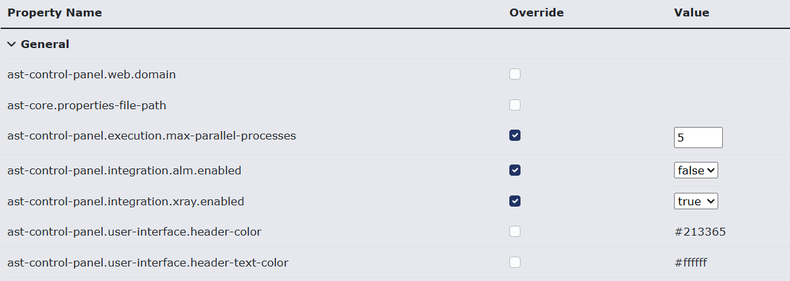
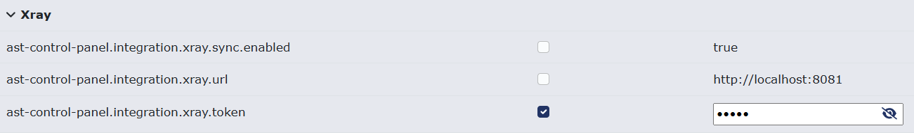
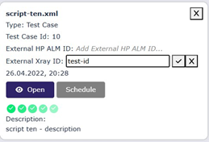
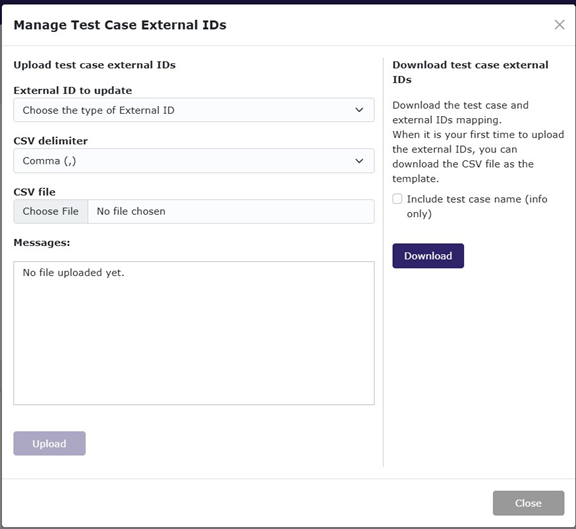
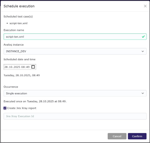
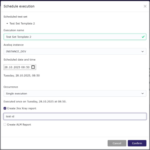
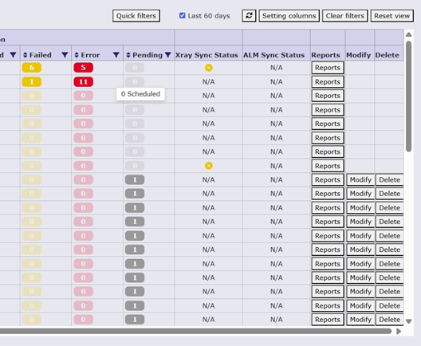
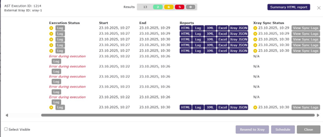
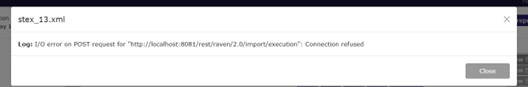

This chapter explains how to set up the **AST Control Panel** to integrate with **Jira** using the **Xray** test management app. This integration allows you to link your automated test cases to external IDs, track execution results, and view synchronization status and logs directly from AST.

### Configuration Settings

To enable the integration, an administrator must navigate to the application properties in the **AST Control Panel**:

- **Enable Integration**: Ensure that the property `ast-control-panel.integration.xray.enabled` is set to **true**.
- **Enter Connection Details**: Input the required Xray configuration parameters, such as the **URL** and **JWT token**.

<figcaption>Xray connection settings in AST Control Panel</figcaption>

<figcaption>Configuration to enable Xray integration</figcaption>

#### Setting Environment Variables(Optional)
If needed the xray sync endpoint can be adjusted by setting the environment variable `AST_CONTROL_PANEL_XRAY_SYNC_ENDPOINT` to the desired URL. 

The default value for this variable is `/rest/raven/2.0/import/execution`. 

If your Xray instance uses a different endpoint, you can set the environment variable accordingly.
On how to set environment variables please refer to the [Setting environment variables](deployment.md#setting-up-environment-variables) documentation.

### Assigning External XRAY IDs to Test Cases

You must link your AST test cases to their corresponding Xray test entities in Jira by assigning an **External Xray ID**.

#### Individual Asignement

1. Go to the 'Test' tab and select a test case to open its details.
2. Use the field in the detail view to assign or edit the '**External XRAY ID**'.

<figcaption>Test case detail with External XRAY ID field</figcaption>

#### Bulk Assigment (CSV Upload)

1. **Right-click** on a test case in the repository tree and select '**Manage External IDs**'.
2. This dialog allows you to upload mappings via a **CSV file**. The CSV must contain the **AST Test Case ID** and the **External Xray ID**.

<figcaption>Dialog for managing bulk external IDs upload</figcaption>

**Sample Xray CSV Upload** - Example content showing the required columns: `AST Test Case ID` and `External Xray ID` for bulk mapping:

~~~bash
AST Test Case ID,External Xray ID;
1,script-xray-id-1;
2,script-xray-id-2;
5,script-xray-id-5;
6,script-xray-id-6;
~~~

### Scheduling and XRAY Synchronization

When a test run is scheduled, you must specify the unique **Xray Execution ID** that results will be synced to. **This is different from the External Xray ID** used for individual test cases.

<figcaption>Schedule dialog with Xray Execution ID field</figcaption>

<figcaption>Schedule execution dialog with 'Create Jira Xray report</figcaption>

<figcaption>Test execution log showing Xray Sync Status column</figcaption>

### Vieving Reports and Sync Logs

After a test run is complete, you can review its status and troubleshoot any issues.

- **View Sync Status**: Click the '**Reports**' button for a completed execution to open a detailed view showing the test execution status and Xray sync logs.
- **Detailed Logs**: In the Reports pop-up window, you can see the synchronization status for each test case and click '**View Sync Log**' for detailed event records.
- **Manual JSON Download**: You can download the **raw JSON payload** sent to Xray by clicking the '**XRAY JSON**' button. This file contains the execution results and metadata, which is useful for debugging.

<figcaption>Detailed execution report showing Xray sync status</figcaption>

<figcaption>Log view of Xray synchronization timeline</figcaption>

Below is an example of a JSON payload sent to XRAY:

~~~JSON
{
  "testExecutionKey": "xray-1",
  "tests": [
    {
      "testKey": null,
      "start": "2025-10-23T10:27:09+02:00",
      "finish": "2025-10-23T10:29:33+02:00",
      "status": "FAIL",
      "comment": "*Test Execution Info*\n || Key || Value ||\n | Testcase ID | 260 |\n  | Testcase Name | stex_13.xml |\n  | Testcase Link | 127.0.0.1:8080/testcase-repository/260 |\n  | Test Set ID | 41 |\n  | Test Set Name | reporting_test |\n  | Test Set Link | 127.0.0.1:8080/test-sets/41 |\n  | Execution Instance | INSTANCE_DEV |\n ",
      "evidences": [],
      "customFields": [
        {
          "id": "2",
          "value": "|| Type || User || Description || Operation Type || Err.Message || Status || CreationTime ||\n"
        },
        {
          "id": "1",
          "value": "127.0.0.1:8080/api/execution/scripts/ast/report/retrieve/by/deeplink/?reportDownloadKey=KN2jJBjKp2v8RLcbBbdWdiSAJpOMQBSFMRWLUdIDxcpuFzBckZ8xD4zPFomD7p4Az39god0GsCDbggUb9TMEVQM7rjm3hDAR8EeC&mimeTypeString=text%2Fhtml"
        }
      ]
    }
  ]
}
~~~