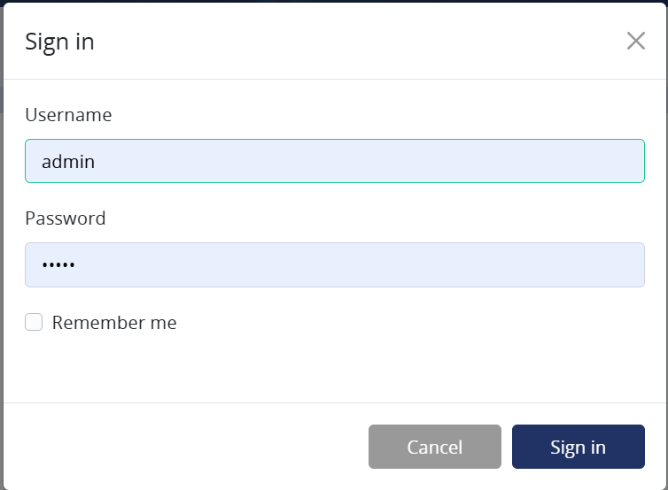

# Login

You can access the control panel with local accounts managed in the Control Panel itself or with Keycloak SSO authentication if you have it set up (see [KeyCloak setup](keycloak.md)).

<figcaption>AST Control Panel user sign-in interface.</figcaption>

!!! info
    An Administrator user with username and password "admin" is provided by default, but we recommend you create another administrator as soon as possible with a stronger password and delete the first one while logged in with the actual new administrator.

