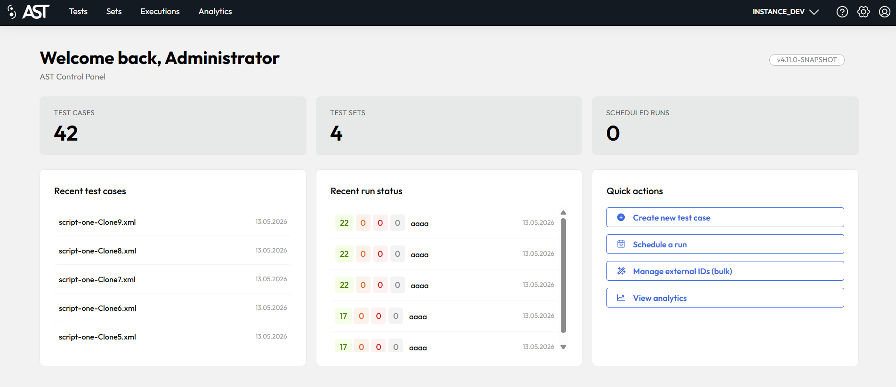

# Landing Page and Navigation

### Landing Page
After successfully logging in, you will be directed to the landing page of the AST application. This page displays an overview of your testing activities and provides quick access to various sections of the application. The landing page is designed to give you a snapshot of your testing environment, including recent test cases, scheduled runs, and quick actions for common tasks.

<figcaption>AST homepage after logging in</figcaption>

Short description of the sections on the landing page is provided in the table below:

| Menu              | Description                                                                                                                                                  |
|-------------------|--------------------------------------------------------------------------------------------------------------------------------------------------------------|
| Test Cases        | Shows the total number of created testcases.                                                                                                                 |
| Test Sets         | Shows the total number of created test sets.                                                                                                                 |
| Scheduled runs    | Shows number of scheduled executions on current avaloq environment.                                                                                          |
| Recent Test Cases | Displays last 5 testcases modified by currently logged in user. Click on testcase to open.                                                                   |
| Recent Run Status | Displays last 5 executions started by currently logged in user and current avaloq environment with their status. Click on the execution to see more details. |
| Quick Actions     | Quick links to actions                                                                                                                                       |

### Main navigation menu (Left side)

| Menu                                          | Description                                                                            |
|-----------------------------------------------|----------------------------------------------------------------------------------------|
|  | Navigates back to the main dashboard or landing page of the application.                     |
| **[Tests](test_case_repository.md)**          | Displays and manages individual test cases. This is the core repository for all tests. |
| **[Sets](test_sets.md)**                      | Organizes multiple tests into logical groups or suites for streamlined execution.      |
| **[Executions](schedule.md)**                 | Displays scheduled and finished executions. Provides executions details.               |
| **[Analytics](analytics.md)**                 | Provides insights and reports on test execution results, trends, and performance.      |

Each tab navigates you to separate sections described in the table and in following chapters in more details.

### Secondary navigation menu (Right side)

| Menu                                                  | Description                                                                                  |
|-------------------------------------------------------|----------------------------------------------------------------------------------------------|
| **Instance Selection**                                | Used to choose the environment or system under test.                                         |
|  | Opens this documentation in a new tab.                                                       |
|      | Contains administrative settings for managing users, permissions, and system configurations. |
|   | Manages the current user's profile, settings, and login information.                         |