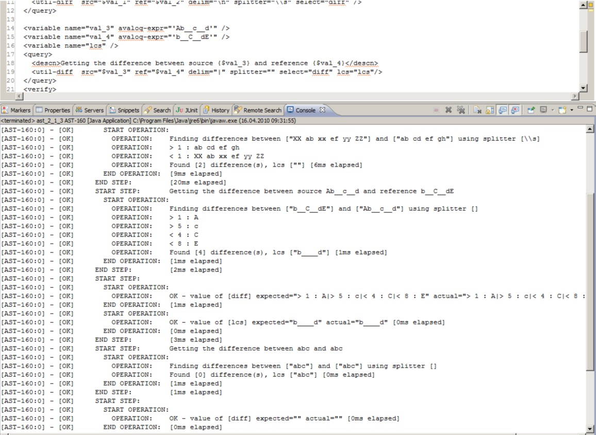

# Query operations
These operations **retrieve information** from a test object. For instance, you can use them to get the status of a message or the attributes of an object.

The AST query operations offer read-only access to entities within the Avaloq Banking System. You can query objects, orders, and messages. Note that the `exec` operation, described in chapter [Exec operation](input_operations.md#exec-operation), is also available for use in query operations. 

The query element also lets you explicitly synchronize with all pillars in the Avaloq Banking System. To do this, use the `enforce-pkp-sync` attribute to enforce the synchronization. For more information, see the configuration settings.

### Object query 
The object query allows you to access instances of any object type within the Avaloq Banking System. 

You can query objects statically using their ID or dynamically.

To dynamically load an object's ID, you can use a combination of the id and property attributes. This operation respects the timeout setting defined in the *service.dynamicloading.timeout_in_sec property*.

***`<query>` | `<obj ...>`*** - Retrieves information about an Avaloq object

|Attributes|Description|
|---|---|
|*id* (IN)|The object can be identified by its key (e.g. ISIN:LU0055731813, RS) or an internal id (e.g. #198276).  Specify its metatype instead, if you want to query an object dynamically. (e.g. {bp} for business partner)|
|*property* (IN)|Properties of object to be retrieved.   If you specified a metatype in the ID, then here specify the criteria like class_id('bp_custr_type')=custr#AND#ref_curry_id!=CHF (more examples below). If none is found, the result will be empty.|
|*object-type* (IN)|Type of object to be retrieved.|
|*domain-type* (IN)|Domain-type of object to be retrieved. This parameter is used in special cases where an object of a given specific type is accessed in a different way. For example objects of type asset are accessed as instances of "obj_asset_realsec".|
|*select* (OUT)|Target variable where the read property (or the object id for dynamic loading) is stored.|

!!! example
    ~~~xml
    <query>
      <descn>Get the name of the created money account</descn>
      <obj id="$id" object-type="macc" property="name"select="m_name" />
    </query>
    <query>
      <descn>Query a container object id with these parameters</descn>
      <obj id="{cont}" property="is_cust=-#AND#bp_id=[{TYPE=bp}domi_country_id=#2089#AND#ref_curry_id=EUR]#AND#bp_id=[{TYPE=bp}marital_status_id=#102]" select="l_found_object_id" />
    </query>
    ~~~

### Order query
Instances of all orders in the Avaloq Banking System can be accessed with the order query.

Alternatively you can use the id and property to load dynamically an order id within the timeout set in `service.dynamicloading.timeout_in_sec`.

***`<query>` | `<doc ...>`*** - Retrieves information about an existing Avaloq order

|Attributes|Description|
|---|---|
|*id* (IN)|Id of order to be retrieved. Alternatively an order key can be used (e.g. extl_ref_nr: "ABCD"). Specify its metatype instead, if you want to query an order dynamically. (e.g. {bp} for business partner)|
|*property* (IN)|Properties of the order to be retrieved.  If you specified a metatype in the ID, then here specify the criteria like class_id('bp_custr_type')=custr#AND#ref_curry_id!=CHF (more examples below). If none is found, the result will be empty.|
|*select* (OUT)|Target variable where the read property is stored.|

!!! example "Example 1"
    ~~~xml
    <query>
      <doc id="$othsec" property="pos.name" select="pos-name" />
    </query>
    ~~~

!!! example "Example 2"
    ~~~xml
    <query>
      <descn>Query a container order id with theseparameters</descn>
      <doc id="{cont}" property="is_cust={-,+}#AND#bp_id=[{TYPE=bp}ref_curry_id=CHF]" select="l_found_order_id" />
    </query>
    ~~~

### Reference order query
The ref-doc query operation allows you to retrieve information from an order that references a specific target order. 

Because referencing orders are often generated asynchronously, this operation is designed to wait until the referenced order is available or a specified timeout occurs. If multiple orders reference the same target order, you can use an index to select the correct one.

***`<query>` | `<ref-doc ...>`*** - Retrieves an order that references a given order

|Attributes|Description|
|---|---|
|*id* (IN)|Id of object to be retrieved. Alternatively the order can be identified by a key (e.g. EXTL_REF_NR:EBA_PAY_12345).|
|*index* (IN)|Index if an order provides multiple references|
|*select* (OUT)|Target variable|

!!! example
    ~~~xml
    <query>
      <descn>Getting settlement of a payment</descn>
      <ref-doc id="$payment" select="settlement"/>
    </query>
    ~~~

### Query Avaloq messages
The message query operation provides access to incoming and outgoing messages from the Avaloq Messaging Interface (AMI). 

Similar to the ref-doc operation, this operation waits until the message of interest is available (or a timeout occurs).

This operation provides a comfortable way to access messages stemming from the processing of a file (regardless of the file type).

***`<query>` | `<msg ...>`*** - Retrieves an Avaloq message.

|Attributes|Description|
|---|---|
|*id* (IN)|Id of the message to be retrieved.|
|*file_id* (IN)|Id of the file, the message belongs to (requires also parameter sequence number).|
|*seq_nr* (IN)|Sequence number of the message within the file specified by parameter file_id.|
|*extl_ref_nr* (IN)|External reference number of the message to be retrieved.|
|*property* (IN)|Properties of message to be retrieved.|
|*select* (OUT)|Target variable.|

!!! example
    ~~~xml
    <query>
      <descn>Get created order by EXTL_REF_NR of inserted msg</descn>
      <msgextl_ref_nr="$sic_tag_03" property="doc_id" select="doc" />
    </query>
    ~~~

### Query xpath
The util-xpath query operation provides the possibility to evaluate xpath expressions on xml-content. 

The result of the xpath query can be a single value or a node list converted to a string with the list items separated by a delimiter.

!!! warning "Important"
    Namespace aware XPATH expressions are **not** supported.

***`<query>` | `<util-xpath ...>`*** - Retrieves an Avaloq message.

|Attributes|Description|
|---|---|
|*src* (IN)|XML source, can be specified with a variable|
|*delim* (IN)|Character or string to separate node list items. If the xpath describes a node list a delimiter has to be specified.|
|*descn* (IN)|Description|
|*select* (OUT)|Target variable|

!!! example
    ~~~xml
    <query>
      <descn>Evaluate XPATH on XML file</descn>
      <util-xpath src="$xml_file" xpath="//descn"select="result" delim=";" descn="Query all descn elements" />
    </query>
    ~~~

#### Query SQL
The `util-sql` operation is used to execute SELECT statements on the Avaloq database. This operation can return either a single value or a single column with multiple rows. If the query returns multiple rows, you must specify a delimiter to separate the values, and the results will be concatenated into a single string.

***`<query>` | `<util-sql ...>`*** - Returns the result of an sql statement.

|Attributes|Description|
|---|---|
|*stmt* (IN)|A select statement returning a single value or a column with multiple rows. Note that characters like '<' must be encoded using HTML entities.|
|*delim* (IN)|Character or string to separate multiple rows. If the sql statement returns more than a single value a delimiter has to be specified.|
|*descn* (IN)|Description|
|*connection* (IN)|Optionally give a connection name as listed by the *ext.conn.** properties in *ast.properties* to execute a query on a separate database.|
|select (OUT)|Target variable|

!!! example
    ~~~xml
    <query>
      <descn> SQL statement returning multiple rows</descn>
      <util-sql stmt="select obj_id from obj_name where name= '{$n}'" delim=";" select="sql_result" />
    </query>
    ~~~

#### Query file

The util-file query operation provides the possibility to read large values from files. The file content can either be read from the local file system or the IO directory of the Avaloq Banking System. With this operation it is also possible to write or append the content of a variable to a local file.

***`<query>` | `<util-file ...>`*** - Reads in the content of a file or writes/appends into a file.

|Attributes|Description|
|---|---|
|*dir* (IN)|Direction indicates whether a file is to be read, written, or appended. Possible values are "write", "append" and "read". Default is "read".|
|*id* (IN)|Id of the file to be read (id corresponds to column id in the FILE_IDX of the Avaloq Banking System).|
|*path* (IN)|Path to the local file that is to be read or written.|
|*descn* (IN)|Description|
|*select* (OUT)|Target variable that holds the content to be written or read.|

!!! example
    ~~~xml
    <!-- reading in from local file system -->
    <query>
      <util-file path="somepath" select="f_content" />
    </query>
    
    <!-- reading in from the Avaloq io directory -->
    <query>
      <util-file path="$file_id" select="f_content" />
    </query>
    
    <!-- writing to local directory -->
    <query>
      <util-file dir="write" path="$fPath" select="$f_content" />
    </query>
    
    <!-- appending to local directory -->
    <query>
      <util-file dir="append" path="$fPath" select="$f_content" />
    </query>
    ~~~

#### Query diff

The `util-diff` query operation finds differences between two values. Like standard diff utilities such as Windiff or GNU Diff, it compares the value of one variable against another. 
The operation then returns both the identified differences and the longest common subsequence of the two variables.

<figcaption>Console output showing the results of comparing two strings with the util-diff operation</figcaption>

***`<query>` | `<util-diff ...>`*** - Finds differences in large strings

|Attributes|Description|
|---|---|
|*src* (IN)|Source string for comparison (mandatory).|
|*ref* (IN)|Reference string to compare against (mandatory).|
|*select* (OUT)|Variable that will be filled with all the differences between the two given strings.|
|*lcs* (IN)|Variable that will be filled with the longest common subsequence of the two given strings.|
|*delim* (IN)|The comparison identifies multiple differences. These differences are concatenated with this delimiter before they are returned.|
|*splitter* (IN)|Pattern to split the two input values into pieces for piecewise comparison. Defaults to the newline character, that is by default a line wise comparison is done.|
|*descn* (IN)|Description|
|*regex* (IN)|A flag when set to true, compares *src* and *ref* to check if equal; if not, it will then check if a regular expression is present in the line of *ref* and will match the pattern against the current line of src. The default is false.|

!!! example
    ~~~xml
    <query> 
      <util-diff src="$val_5" ref="$val_6" delim="\n" splitter="" select="diff" lcs="lcs" />
    </query>
    ~~~

!!! example "Example: Two strings are compared"
    - Source: "b__C__dE"
    - Reference: "Ab__c__d"
    - Splitter "" (Empty string resulting in comparison by character)
    The result is four differences and the longest common subsequence is:`"b____d"`.

#### Query replace

The `util-replace` operation allows to replace certain key words in a string or a variable with different values.

***`<query>` | `<util-replace ...>`*** - Replace key words with values

|Attributes|Description|
|---|---|
|*src* (IN)|Source string for replacement (mandatory).|
|*select* (OUT)|Variable that will be filled with the replaced content of *src*. The same variable can be used for *src* and *select*.|
|*replacement* (IN)|Contains attributes *key* and *value*.|
|*key* (IN)|Contains a string from *src* that is to be replaced with *value*.|
|*value* (IN)|Contains a string to replace *key*.|
|*descn* (IN)|Description|

!!! example
    ~~~xml
    <query>
      <util-replace src="{$text}" select="text" descn="REPLACE MSG">
        <replacement key="[val_date]" value="$l_date" />
        <replacement key="[amount]" value="$l_amt" />
      </util-replace>
    </query>
    ~~~

#### Query latest-order

The `latest-order` operation fetches and displays the latest Avaloq orders in AST.

***`<query>` | `<latest-order ...>`*** - Display values of latest orders in avaloq.

|Attributes|Description|
|---|---|
|*limit* (IN)|Limit number of items to shown in Avaloq orders. Default value is 20.|
|*select* (OUT)|An AST Variable to specify and save the output operation.|

!!! example
    ~~~xml
    <query>
      <latest-order limit="10" select="text" descn="LATESTORDER TEST" />
    </query>
    ~~~

#### Query order-generation

The `order-generation` operation allows to generate a template for an AST test based on an existing order id.

***`<query>` | `<order-generation ...>`*** - Generate a template test XML to re-create an Avaloq order.

|Attributes|Description|
|---|---|
|*id* (IN)|AST expression to specify the Avaloq order ID to be scanned to generate the AST test template.|
|*descn* (IN)|Description of this operation instance.|
|*validate* (IN)|Boolean to specify if AST should try to automatically trim down the test through a strict validation. Depending on the complexity of the order, this may results in a failure. Defaults to false.|
|*output-xml* (OUT)|The name of the generated AST test template XML that will be saved upon completion.|

!!! example
    ~~~xml
    <query>
      <order-generation id="100000015324" output-xml="generated-test.xml" descn="generating atest template for 00000015324" />
    </query>
    ~~~