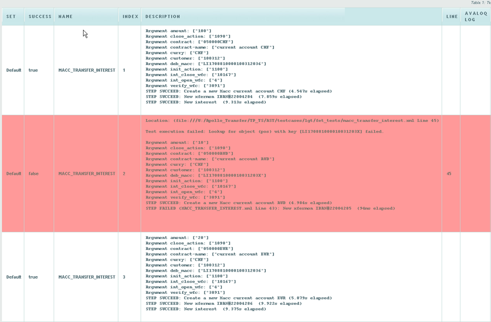

# Reports
When you execute test cases with the AST tool, it automatically collects information about the test run and provides it to you through two main output channels: the **AST Log** and a **XML Report**.

#### AST Log ####

The AST log provides real-time feedback on the test run as it happens.

- **Console Output**: The log is displayed directly "on the go" in the console. This is useful for monitoring the progress of your tests in real time.

#### The  XML Report ####
!!! info
    Upon completion of the test run, AST generates a single, comprehensive XML file that summarizes the entire test run. 

This report is the foundation for creating other report types.

- Primary Report Format: The XML file is the primary output format. It's designed to be **machine-readable**, making it easy to use as a **data source**.

- Generating Other Reports: You can use this XML report to generate various other report formats, such as **HTML, Excel,** or custom reports tailored to your specific needs.

## Report Formats and Generation (HTML, XML, Excel)

### XML Report
!!! info
    The AST test automation tool generates a detailed XML report for every test run. 

This report, which is the central source of information about a test's execution, is defined by the *out.xsd* schema file.

### HTML report
!!! info
    The HTML report provides a user-friendly, web-based view of your test execution results.


<figcaption>Snippet of the HTML test report clearly distinguishing between successful (green) and failed (red) test steps</figcaption>

It is generated automatically from the master XML report after the test run is complete.

#### Key Features

- **User-Friendly Format**: The HTML format offers a clear, web-based display of test results, making it easy to review the success and failure of test steps.
- **Source Generation**: The HTML report is generated from the comprehensive XML report using an XSL Transformation (XSLT).


#### Configuration

The specific style and content of the HTML report are controlled by a stylesheet defined in your AST property file (*ast.properties*):

|Property Name|Example Value|Description|
|---|---|---|
|ast.report.xslt|report_summary.xsl|Specifies the path and name of the XSLT file used to transform the XML report into the final HTML output.|

By modifying the referenced XSLT file, you can customize the appearance and level of detail presented in the final HTML report.


### Excel Report

The Excel report is generated from an XML test run file using XPath expressions embedded inside the Excel template.

Each sheet in the template contains expressions that extract data from the XML and populate the report.

The expressions are evaluated by the AST report generator when creating the Excel report.

For more information, see the [Excel Report Template](#excel-template-and-xpath-expressions) section.


## Viewing Execution Reports
!!! info
    The AST Control Panel provides several methods for reviewing the results and logs of executed tests, both through the graphical interface and via the REST API.

### Accessing Reports in the Control Panel

You can view reports at three levels of detail: Execution, Test Set, and Individual Test Case.

#### The Schedule (Execution) View

The **Schedule** menu functions as the central log for all test activity, showing the status of both scheduled and completed runs.

- **Execution Grid**: The main table displays key metadata for every run, including the Start Date, End Date, User Name, and the current Status.
- **Execution Results Summary**: This summary details the total number of tests that Passed, Failed, Errored, and are Pending.
- **Detailed Execution Report Window**: Clicking the Report action in the grid opens a separate detail window showing the results for that entire run.
    - This window lists every Test Case included in the run, its Status, Start and End times.
    - It offers a Summary HTML Report button for a full-run overview.

#### Test Case Repository (Individual Test Case)

You can view the latest report for an individual test case directly from the Test Case Repository.

- **Status Bubble**: Clicking on the colored status bubble next to a test case opens its execution report.
- **Report Formats**: Reports for individual test cases are available in three distinct formats for review and export:

!!! info
    The **Analytics** menu also provides the ability to export a CSV reports. See the [Analytics](analytics.md) documentation for details.

## Customizing Reports

You can customize the content and format of Excel reports by using an Excel template and embedding **XPATH expressions**. When a test run is complete, AST enriches your template by replacing cell contents with data pulled directly from the **XML Report** using these expressions.

### Configuration and Templates

The process relies on defining the necessary files in your configuration:

- **XML Report**: This is the base data source generated after every test run. The Excel customization process uses data from this file.
- **Excel Template**: This is the Excel file (.xls or .xlsx) you design with your desired layout.
- **HTML Template**: This is the html you can design with your desired layout.

The template files can be uploaded in [Configuration](admin.md#configuration) section. Admin role is required to upload these files

### Excel template and XPATH expressions

The Excel template supports three expression formats:

##### 1. Single Value Expression

=== "Syntax"
    ```
    [xpath]
    ```
=== "Example"
    ```
    [testrun/@status]
    ```

This returns a single value from the XML and writes it into the cell.

=== "Example XML"

    ```xml
    <testrun status="ok">
    ```

=== "Result in Excel"

    ```
    ok
    ```

---

##### 2. Multi-value Expression

=== "Syntax"

    ```
    [[xpath]]
    ```

=== "Example"

    ```
    [[//testcase/@status]]
    ```

This returns all matching nodes and writes them vertically into the column.

=== "Example XML"

    ```xml
    <testcases>
      <testcase status="ok"/>
      <testcase status="ok"/>
      <testcase status="error"/>
    </testcases>
    ```

=== "Result in Excel"

    ```
    ok
    ok
    error
    ```

Each value is written into a new row.

---

##### 3. Row-based Expression

=== "Syntax"

    ```
    [[[nodeset_xpath;relative_xpath]]]
    ```

=== "Example"

    ```
    [[[//testcase;@status]]]
    ```

Meaning of the example:

1. Select all nodes using `testcase`
2. For each selected node evaluate `status`
3. Write results row-by-row in the sheet

#### Test Cases Sheet

The **Test Cases** sheet contains all executed test cases.

Default expressions used in the template:

| Column | Expression |
|------|------|
| Status | `[[//testcase/arguments/argument[@name="TESTCASE_ID"]/../../@status]]` |
| Test Case ID | `[[//testcase/arguments/argument[@name="TESTCASE_ID"]/@value]]` |
| Description  | `[[//testcase/arguments/argument[@name="DESCRIPTION"]/@value]]` |
| Test Script | `[[//testcase/arguments/argument[@name="TESTCASE_ID"]/../../testscript]]` |
| Test Data | `[[//testcase/arguments/argument[@name="TESTCASE_ID"]/../../testdata]]` |
| Data Index | `[[//testcase/arguments/argument[@name="TESTCASE_ID"]/../../index]]` |

Rows are generated from the `testcase` nodes in the XML.


!!! warning "Important"
    Expressions that depend on optional fields may behave differently.

    For example:
    
    ```
    [[//testcase/arguments/argument[@name="TESTCASE_ID"]/@value]]
    ```
    
    This expression only returns nodes that contain `TESTCASE_ID`.
    
    If some testcases do not contain this argument, those rows will not appear in the result.


#### Alternative Pattern

To ensure that **all testcases appear in the report**, rows should always be anchored on the `testcase` node.

Other fields can then extract values relative to that testcase.

Example:

| Column       | Expression |
|--------------|------|
| Status       | `[[//testcase[@status="ok"]/@status]]` |
| Test Case ID | `[[//testcase/arguments/argument[@name="TESTCASE_ID"]/@value]]` |
| Description  | `[[//testcase/arguments/argument[@name="DESCRIPTION"]/@value]]` |
| Test Script  | `[[//testcase[@status="ok"]/testscript]]` |
| Test Data    | `[[//testcase[@status="ok"]/testdata]]` |
| Data Index   | `[[//testcase[@status="ok"]/index]]` |

Typical AST XML structure:

```xml
<testrun>
  <testcases>
    <testcase status="ok" name="TEST_A">
      <arguments>
        <argument name="TESTCASE_ID" value="TEST_A_1"/>
      </arguments>
      <testscript>test_a.xml</testscript>
      <testdata>data.xls</testdata>
      <index>0</index>
    </testcase>
  </testcases>
</testrun>
```