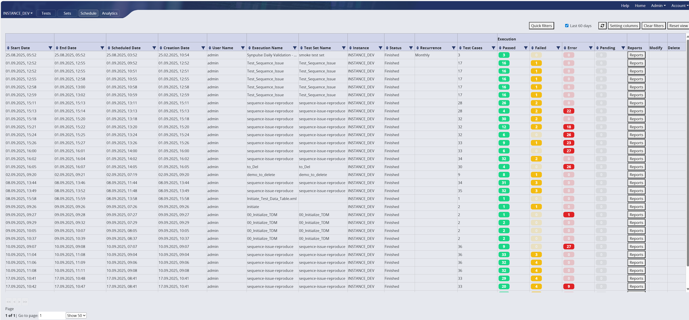
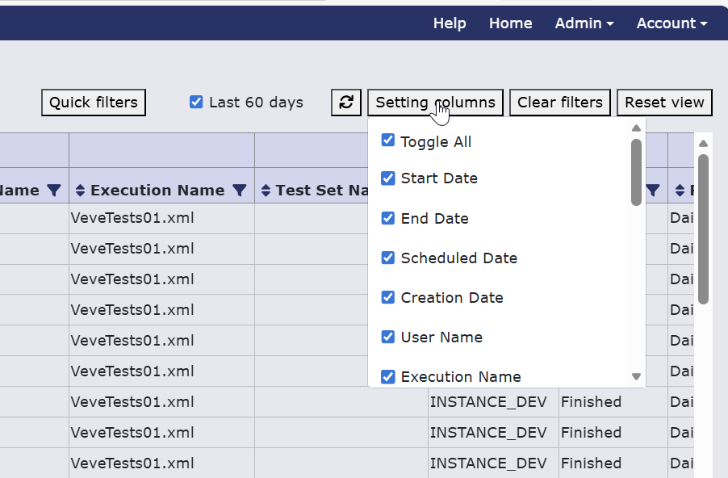
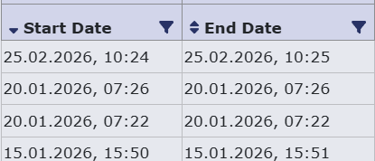

Schedule tab contains all scheduled runs, executed runs and currently executed runs with all their details. It is the main place to monitor and manage test execution.

<figcaption>Schedule tab view: table with all runs</figcaption>

**List of columns with explanations**

| Column               | Description                                                          |
|----------------------|----------------------------------------------------------------------|
| Start date           | Starting date of a run                                               |
| End date             | Ending date of a run                                                 |
| Scheduled date       | Scheduled date of a run                                              |
| Creation date        | Creation date of a run                                               |
| User name            | User name that created the set / test case                           |
| Execution name       | User name that executed the run                                      |
| Test set name date   | Creation date of test set name                                       |
| Instance             | Instance where tests are executed                                    |
| Status               | Status of the execution                                              |
| Recurrence           | Is the run going to be reocurring?                                   |
| Test cases           | Number of test cases                                                 |
| AST executor         |                                                                      |
| External Xray        |                                                                      |
| Passed               | Number of passed tests from test set                                 |
| Failed               | Number of failed tests from test set                                 |
| Error                | Number of erroneous tests from test set                              |
| Pending              | Number of not yet executed tests from test set                       |
| Xray sync status     |                                                                      |
| ALM sync status date |                                                                      |
| Reports              | Clickable button navigating us to reports                            |
| Modify               | Action available only for not yet processed runs. To modify the set. |
| Delete               | Action available only for not yet processed runs. To modify the set. |

This table can be altered by adding or removing mentioned columns via clicking  the 'setting columns' button. This will open a pop-up with all columns to be selected or unselected as checkboxes. 
The table can be set to its default view by clicking on 'reset view' button.

<figcaption>Set columns with all columns to be selected or unselected as checkboxes</figcaption>

Quick filter also allows us to display data only from selected time period

<figcaption>List of specific time periods to use as quick filter</figcaption>

Filtering can be done also in column header clicking on the funnel icon to further specify data you want to display. When a filter is set on a column the funnel icon is red.
To clear these settings there are 'clear filters' button, or you can click on the funnel icon again and clear filters from there.
You can also sort the data in the column in ascending or descending order by clicking on the arrow icons in the left of the column header. To clear sorting click on the arrow icons again until both appear.

<figcaption>In the image you can see the start date column has the sorting descending active and the end date column has no sorting indicated by the arrows on the left side of the column header. 
You can also see the funnel icon that is used for filtering on the right side of the column header. </figcaption>

Clicking on the report button will show the same functionality as shown in the Test set [reports tab](test_sets.md#reports-tab).