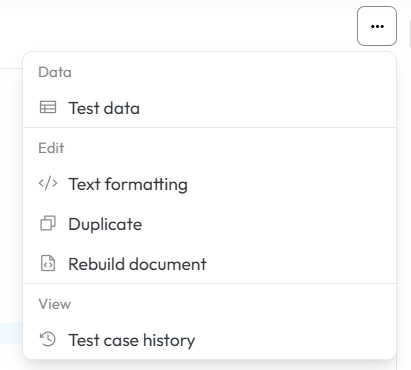
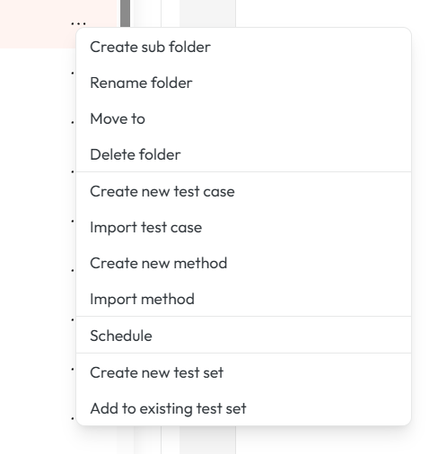
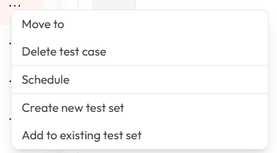
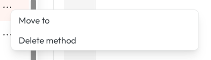

# Test Case Repository

Click 'Tests' tab on [navigation](navigation.md) panel to go to test repository. Following chapter describes the functionality and how to navigate basic features of test case repository.

## Interface overwiew

The interface of AST is divided into two main sections:

1. **left-hand navigation panel** with file tree structure and filtering options

2. **central content area** with test content administration functionalities and user-specific options.

3. **right-hand side panel** with test case details and metadata

The interface provides hierarchical navigation for test scripts and a central content area for viewing and editing the XML-based test logic.

<figcaption>Test Case Repository displaying the hierarchical tree of test cases and the XML editor pane with the metadata on the right</figcaption>

!!! info
    Both the left hand navigation panel and the right hand side panel are collapsible, allowing users to maximize the central content area when needed for a more focused view on test case details and editing.
  
## Managing Test Cases

The tree display provides a clear and organized view of the entire test case repository. 
This hierarchical structure allows users to browse through different categories and sub-categories of tests, akin to a file system. 

Each folder within the tree is labeled with a descriptive name(of the users choosing) and includes a count of the test cases it contains, giving the user an immediate sense of the repository's scope.

User can create modify or delete folders, test cases or methods.
To work with test cases or folders click on the three dots. Then you see **[context menu](#create-edit-and-manage-test-cases)** with all the functionalities.

### Metadata and details

When a test case is opened , the main content area of the control panel populates with its details and controls.
In the right panel you can see its details. You can also see the last run status of this testcase. In this metadata section you can also modify the name of the test case and its description.
When Xray or ALM integration is set up, you can also see the linked external IDs and you can also bulk upload or download these IDs.

<figcaption>Detailed view of a selected test case information containing key metadata, external IDs and the last run.</figcaption>

The last run status if clickable and opens a dialog where you can download the execution report.

### Execution Reporting

After a test case has been executed, a user can access its detailed report. You can access it by clicking on the last run status in test case details.
This report offers different formats for download.

<figcaption>Execution report display from quick access of test case details</figcaption>

### Editor features
To see the testcase content you can single click on a testcase. This will open the testcase in the preview mode. 
If you single click another testcase while having one already opened in preview mode, the previous one will be closed and the new one will be opened in preview mode.

To pin the testcase you need to use double click. In this mode the testcase will be pinned, and you can open another testcase in preview mode without closing the pinned one.
If you start to edit a testcase opened in preview mode it will be automatically pinned.

Testcase in preview mode is indicated by the name in italic in the test case tabs, while pinned one is indicated by the name in normal font.

The actions bar at the bottom provides critical functionalities for interacting with the selected test case:

1. **Save**  modifications

2. **Trial Run** (test run)

3. **Schedule** (schedule execution)

These controls are essential for a user's workflow, allowing for quick validation and execution of a test without leaving the screen.

Furthermore, a dedicated panel on the right side of the interface provides additional metadata and high-level actions for the selected test. 
This section summarizes key information like the File Name and Path of the test case, offering a quick reference.

This multi-pane layout ensures that the user has a complete overview of the test case's location, content, and available actions all in one view.

### Additional editor features

Test case editor offers another set of useful functionalities that help you with code checking, version comparison and data upload. These are accessible in upper right part of editor by click on the three dots button.

#### Test case data

After clicking 'test data' button you can:

1. Upload new excel file with data

2. Download data file that is currently in use

3. Remove the data file

<figcaption>Test case data modal</figcaption>

!!! warning
    Uploading new excel file removes old one. There can be only 1 data file in usage!

To understand more the test data topic please read this chapter: **[Test script and test data design](test_script_and_test_data.md)**.

#### Text formatting
Text formatting helps you to checks how the document would look after formatting rules are applied, without permanently changing it. It helps you preview spacing, indentation, and layout issues to confirm the formatting is correct before saving or publishing.

#### Duplicate
Duplicate creates an exact copy of the testcase. This is useful for creating similar test cases without starting from scratch, allowing you to modify the duplicate while keeping the original intact.

#### Rebuild document

Rebuild document reprocesses the entire file from scratch. The editor re-parses the document, re-applies structure, references, and validations to make sure everything is consistent and up to date. It’s typically used after major changes or when the document gets out of sync.

#### Test case history

Test case history button displays all the edited and saved versions of displayed document. 
You can display all of these in editor, change them and of course compare these changes with selected versions.

<figcaption>History of all saved change of test case</figcaption>

To compare different versions click the button with corresponding name and select version from dropdowns which you want to compare.

<figcaption>Compare functionality</figcaption>

## Create, edit and manage test cases

Creating of a new test case or folder is possible via the Create New button.

<figcaption>Create new test case or folder or other</figcaption>

Moving of test cases, folders and methods is possible via drag and drop or via the context menu. 
To move an item using drag and drop, simply click and hold the item you wish to move, then drag it to the desired location in the tree structure and release it. 
The interface will provide visual cues to indicate valid drop targets.

To drag and drop multiple items at once, hold down the Ctrl key (or Command key on Mac) while selecting the items you want to move. 
You can also hold down the Shift key to select a range of items.
Then, click and hold one of the selected items, drag them to the desired location, and release to drop them together.

Other functionalities are available via the context menu, which can be accessed by clicking on the three dots next to each folder, test case or method.

### Folder context menu

<figcaption>Folder specific context menu</figcaption>

| Actions for folder       | Description                                                                                |
|--------------------------|--------------------------------------------------------------------------------------------|
| Create sub folder        | Creates new sub folder in selected folder                                                  |
| Rename folder            | Renames selected folder                                                                    |
| Move to                  | Opens a dialog to move selected folder to another location in the tree structure.          |
| Delete folder            | Permanently deletes selected folder                                                        |
| Create new test case     | Creates new test case in selected folder                                                   |
| Import test cases        | Imports test case into selected folder from file.                                          |
| Create new method        | Creates new method in selected folder                                                      |
| Import methods           | Imports new method from file                                                               |
| Schedule                 | Opens a dialog to schedule a single execution or a series of executions for the test case. |
| Create New Test Set      | Allows the user to create a new group or suite and add the current test case to it.        |
| Add to Existing Test Set | Enables the user to add the selected test case to an already existing test set.            |

### Test case context menu

<figcaption>Test case specific context menu</figcaption>

| Actions for Test case    | Description                                                                                |
|--------------------------|--------------------------------------------------------------------------------------------|
| Move to                  | Opens a dialog to move selected testcase to another location in the tree structure.        |
| Delete Test Case         | Permanently removes a test case from the repository. Note: This action cannot be undone.   |
| Schedule                 | Opens a dialog to schedule a single execution or a series of executions for the test case. |
| Create New Test Set      | Allows the user to create a new group or suite and add the current test case to it.        |
| Add to Existing Test Set | Enables the user to add the selected test case to an already existing test set.            |

### Method context menu

<figcaption>Method specific context menu</figcaption>

| Actions for Method | Description                                                                           |
|--------------------|---------------------------------------------------------------------------------------|
| Move to            | Opens a dialog to move selected method to another location in the tree structure.     |
| Delete Method      | Permanently removes a method from the repository. Note: This action cannot be undone. |

!!! info
    The name and description of the test cases and methods can also be edited in the right panel when the test case is opened. This allows for quick updates to metadata without needing to access the context menu.

To understand further how to write test case scripts please read this chapter: **[Test script and test data design](test_script_and_test_data.md)**. 