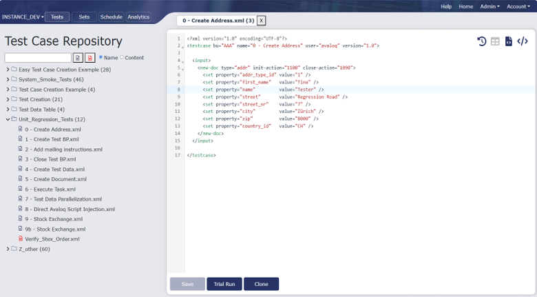
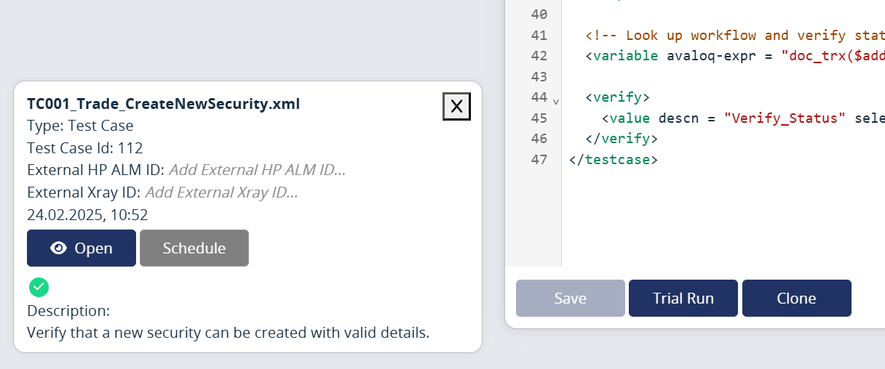
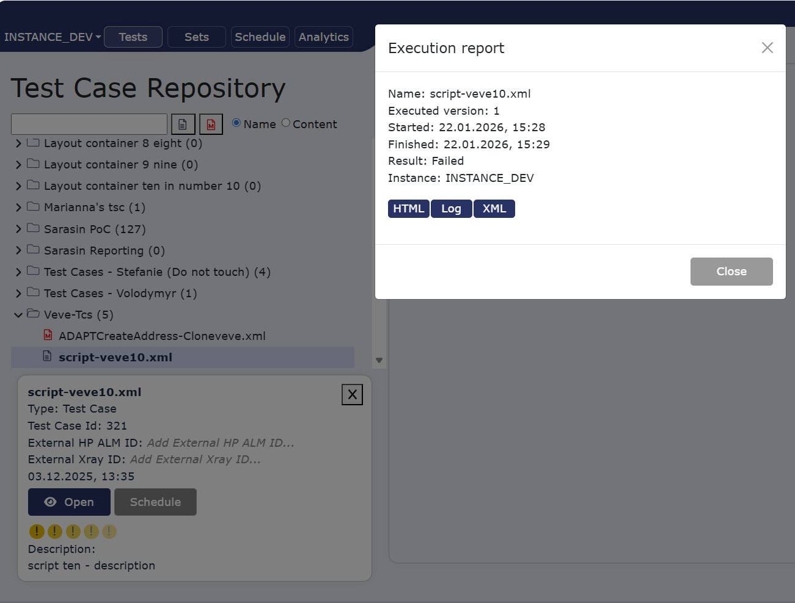
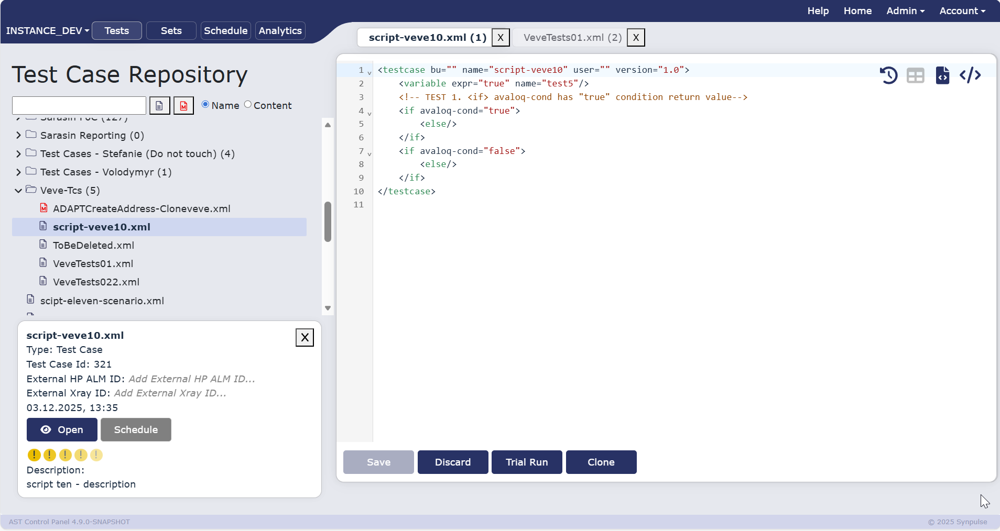
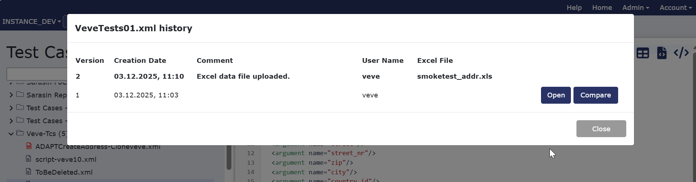
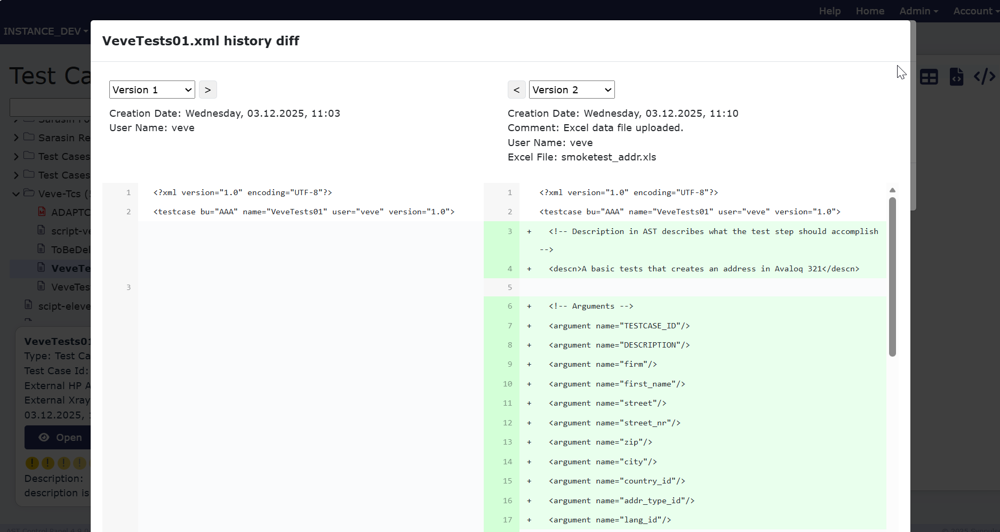
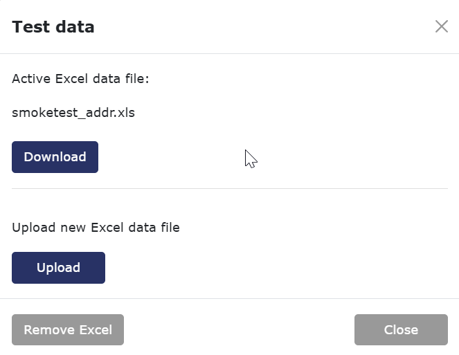
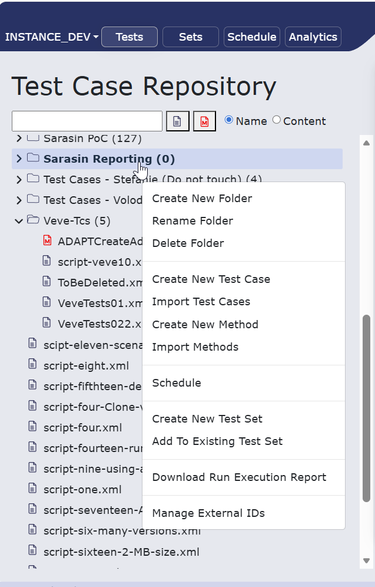
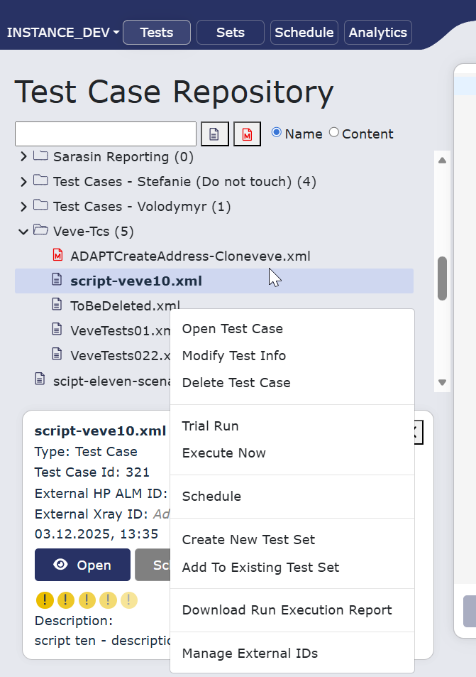
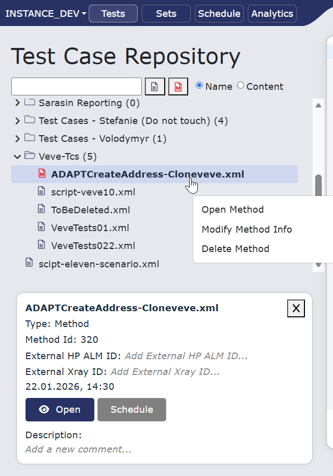

# Test Case Repository

Click 'Tests' tab on [navigation](navigation.md) panel to go to test repository. Following chapter describes the functionality and how to navigate basic features of test case repository.

!!! info
    The Test menu on the AST Control Panel is designed for the comprehensive management of automated test cases.

## Interface overwiew

The interface of AST is divided into two main sections:

1. **left-hand navigation panel** with menu structure and filtering options

2. **central content area** with test content administration functionalities and user-specific options.

The interface provides hierarchical navigation for test scripts and a central content area for viewing and editing the XML-based test logic.

<figcaption>Test Case Repository displaying the hierarchical tree of test cases and the XML editor pane.</figcaption>
  
## Managing Test Cases

!!! info
    Most of the work with test cases and test sets is done on left side  of the screen focusing on navigational tree containing folders with test cases and methods. Right side is reserved for display and editing the content of test case. 

Tree display provides a clear and organized view of the entire test case repository. 
This hierarchical structure allows users to browse through different categories and sub-categories of tests, akin to a file system. 

Each folder within the tree is labeled with a descriptive name(of the users choosing) and includes a count of the test cases it contains, giving the user an immediate sense of the repository's scope.

User can create modify or delete folders, test cases or methods.
To work with test cases or folders right-click the mentioned item. Then you see **[context menu](#create-edit-and-manage-test-cases)** with all the functionalities.

### Test case details

When a specific test case is selected from this repository (by double-clicking the test case), the main content area of the control panel populates with its details and controls.
In the left panel you can see its details and further options to 'open' or to 'schedule' the test case without any further changes. 

<figcaption>Detailed view of a selected test case. Key metadata, external IDs, and direct action controls for development and validation are presented in a multi-pane layout.</figcaption>

Under Open and schedule buttons are test run status button that show us results of last 5 runs. You can click on to display / download clicked execution report.

### Execution Reporting

After a test case has been executed, a user can access its detailed report.
This report offers three different viewing formats to accommodate various user needs and external tools: HTML for a user-friendly, web-based view; Log for a detailed, step-by-step text record; and XML for a structured data format suitable for parsing by other applications.

<figcaption>Execution report display from quick access of test case details</figcaption>

### Editor features
To continue to editing functionalities of test case details click 'Open' button to see test case content.

The actions bar provides critical functionalities for interacting with the selected test case:

1. **Save** or **discard** any modifications

2. **Trial Run** (test run)

3. **Clone** (duplicate the test)

 
<figcaption>Test case editor with all options</figcaption>

These controls are essential for a user's workflow, allowing for quick validation and execution of a test without leaving the screen.

Furthermore, a dedicated pane at the bottom-left corner of the interface provides additional metadata and high-level actions for the selected test. 
This section summarizes key information like the File Name and Path of the test case, offering a quick reference. 

It also includes buttons to Open the test or Schedule its execution, integrating the test management with the wider scheduling features of the AST Control Panel.

This multi-pane layout ensures that the user has a complete overview of the test case's location, content, and available actions all in one view.

Each test case is opened in separate tab. You can have maximum of 8 test cases opened at one time.

### Additional editor features

Test case editor offers another set of useful functionalities that help you with code checking, version comparison and data upload. These are located in upper right part of editor.

#### Test case history

Test case history button displays all the edited and saved versions of displayed document. 
You can display all of these in editor, change them and of course compare these changes with selected versions.

<figcaption>History of all saved change of test case</figcaption>

To compare different versions click the button with corresponding name and select version from dropdowns which you want to compare.

<figcaption>Compare functionality</figcaption>

#### Test case data

After clicking 'test data' button you can:

1. Upload new excel file with data

2. Download data file that is currently in use

3. Remove the data file

<figcaption>Test case data modal</figcaption>

!!! warning
    Uploading new excel file removes old one. There can be only 1 data file in usage!

To understand more the test data topic please read this chapter: **[Test script and test data design](test_script_and_test_data.md)**.

#### Rebuild document

Rebuild document reprocesses the entire file from scratch. The editor re-parses the document, re-applies structure, references, and validations to make sure everything is consistent and up to date. It’s typically used after major changes or when the document gets out of sync.

#### Text formatting
Text formatting helps you to checks how the document would look after formatting rules are applied, without permanently changing it. It helps you preview spacing, indentation, and layout issues to confirm the formatting is correct before saving or publishing.

## Create, edit and manage test cases

!!! info
    Right-click the test case/method or folder (in the navigation tree) to invoke context menu with a range of actions.

<figcaption>Create new test case or folder or other... via test case or folder right click</figcaption>

These functions streamline the entire test management workflow:

### Folder context menu

| Actions for folder            | Description                                                                                |
|-------------------------------|--------------------------------------------------------------------------------------------|
| Create new folder             | Creates new folder in tree structure                                                       |
| Rename folder                 | Renames selected folder                                                                    |
| Delete folder                 | Permanently deletes selected folder                                                        |
| Create new test case          | Creates new test case                                                                      |
| Import test cases             | Imports test case into selected folder from file.                                          |
| Create new method             | Creates new method                                                                         |
| Import methods                | Imports new method from file                                                               |
| Schedule                      | Opens a dialog to schedule a single execution or a series of executions for the test case. |
| Create New Test Set           | Allows the user to create a new group or suite and add the current test case to it.        |
| Add to Existing Test Set      | Enables the user to add the selected test case to an already existing test set.            |
| Download Run Execution Report | Provides the option to download execution reports for use with external reporting tools.   |
| Manage external IDs           | Takes care of external ID management (download present ones or upload new ones)            |

### Test case context menu

<figcaption>Test case specific context menu</figcaption>

| Actions for Test case         | Description                                                                                |
|-------------------------------|--------------------------------------------------------------------------------------------|
| Open Test Case                |Opens an existing test case for viewing or editing.|
| Modify Test Information       |Enables the user to change the name or other high-level metadata of the test case.|
| Delete Test Case              |Permanently removes a test case from the repository. Note: This action cannot be undone.|
| Trial Run                     |Initiates an execution of the test case that does not record the results, ideal for quick debugging or validation.|
| Execute Now                   |Schedules the test case for immediate execution.|
| Schedule                      | Opens a dialog to schedule a single execution or a series of executions for the test case. |
| Create New Test Set           | Allows the user to create a new group or suite and add the current test case to it.        |
| Add to Existing Test Set      | Enables the user to add the selected test case to an already existing test set.            |
| Download Run Execution Report | Provides the option to download execution reports for use with external reporting tools.   |
| Manage external IDs           | Takes care of external ID management (download present ones or upload new ones)            |

### Method context menu

<figcaption>Method specific context menu</figcaption>

| Actions for Method | Description                                                                           |
|--------------------|---------------------------------------------------------------------------------------|
| Open Method        | Opens an existing method for viewing or editing.                                      |
| Modify Method Info | Enables the user to change the name or other high-level metadata of the method.       |
| Delete Method      | Permanently removes a method from the repository. Note: This action cannot be undone. |

To understand further how to write test case scripts please read this chapter: **[Test script and test data design](test_script_and_test_data.md)**. 