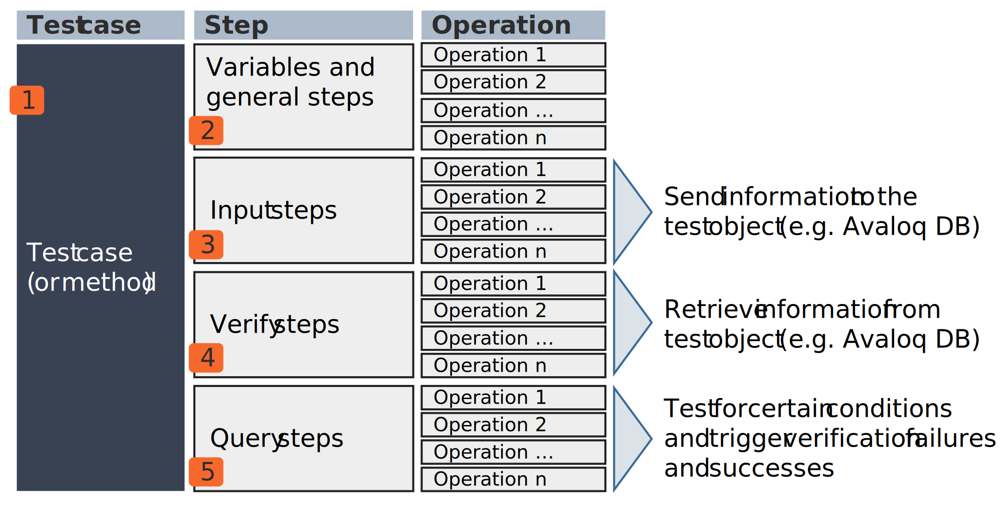
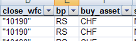
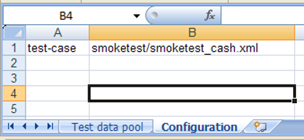
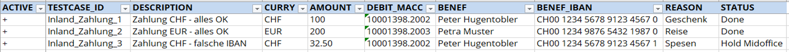

# Test Script and Test Data

## Test script XML Structure and Definition
Test cases are defined using XML notation, consisting of an opening tag, attributes, values, and a closing tag.

The basic structure of a test case is enclosed within the **`<testcase>`** element:

~~~xml
<?xml version="1.0" encoding="iso-8859-1"?>
<testcase version="1.0" user="avaloq" bu="AAA" name="uuid">

</testcase>
~~~

The table below details the attributes for the `<testcase>` tag:

|Attributes|Mandatory?|Description|
|---|---|---|
|*version*|Yes|Version number is always 1.0|
|*user*|Yes|User to log in|
|*bu*|Yes|Business unit to log in.|
|*name*|Yes|Name of the test case. It must correspond to the filename.|
|*max-errors*|No|Maximum error limit in order before the test is interrupted. Test error limit validation is only applicable if the value is less than `ast.verification_failure` property's numeric value in *ast.properties*. If `ast.verification_failure` is `continue`, then the `max-errors` will be ignored and the test run will continue.|
|*extra*|No|Advanced flags are explicit here, for now only the following flags are available: `skipping-empty-data-sets=true` to skip tests with an empty data set instead of throwing an error.|

The XML notation supports various formats for defining attributes, ranging from multi-line long notation to a single-line compact format:

|Type|Notation|Comment|
|---|---|---|
|Long| `<annotation>`   &ensp; `<key>`   &emsp; `"Type"`   &ensp; `</key>`  &ensp; `<value>`   &emsp; `"Functional test"`   &ensp; `</value>`   `</annotation>` |Attributes as child elements on several lines|
|Medium|`<annotation>`   &ensp; `<key>"Type"</key>`  &ensp; `<value>"Functional test"</value>`   `</annotation>`|Attributes as child elements on one line|
|Short|`<annotation key="Type" value="Functional test">`   &ensp; ...  `</annotation>`|Base element with attributes on several lines.|
|Compact|`<annotation key="Type" value="Functional test" />`|Base element with attributes on one line.|

### Test Steps
AST differentiates between three primary step types:
- **`<input>`** - Sends a command to the Avaloq Banking System.
- **`<query>`** - Queries information from the Avaloq Banking System.
- **`<verify>`** - Verifies equality of properties.

<figcaption>Structural decomposition of AST test case into Input, Query, Verify steps, and 1.n Operations</figcaption>

AST executes test steps sequentially, from top to bottom. The test script language employs a single flow control model and does not support nested flow controls.

### Conditional Execution

A **condition** can be defined for any **test step**. If the condition is met, the step executes; otherwise, it is skipped. **Conditions** can be based on **Avaloq script** or **JavaScript**:

~~~xml
<input avaloq-cond="... a condition ..."> ... 
<input script-cond="... a JavaScript condition ..."> ...
~~~

!!! example "Example 1"
    ~~~xml
    <invoke-method name="sag/XYZ/foo" avaloq-cond="$var = 0">
    ~~~

!!! example "Example 2"
    ~~~xml
    <input avaloq-cond="$sell_qty is not null"></input>
    ~~~

!!! example "Example 3"
    ~~~xml
    <wait avaloq-cond="doc_forex($doc).wfc_status_id=54" raise-msg="Settlement was not processed" />
    ~~~

### User-Specific Description

Each step can include a user-specific description using the `<descn>` element or a `descn` attribute. 

This allows for the use of business-relevant messages in the AST log and reports. The visibility of this description in the log and reports is dependent on its placement and the `ast.base.log_level` setting.

|Placement|Test case|Step|Discussion|
|---|---|----|---|
|Sample|`<testcase ...>` &ensp;`<descn>` &ensp;&ensp;My testcase description &ensp;`</descn>` &ensp;... `</testcase>`|`<input>` &ensp;`<descn>` &ensp;&ensp;My input step description &ensp;`</descn>` &ensp;... `</input>`|`<mass-pay descn="My Payment Test description">` &ensp;... `</mass-pay>`|
|Placement of `DESCN` element|`DESCN` must be placed right after the opening tag of a `<testcase>` element  (i.e., before any further steps or operation elements)|`DESCN` must be placed right after the opening tag of input, query or verify elements (i.e., before any operation elements)|`DESCN` must be placed as an attribute within the opening tag of an operation element|
|Visible in Log and Reports, if `ast.base.log_level` set to|Testcase Step Operation Detail|~~Testcase~~ Step Operation Detail|~~Testcase~~ ~~Step~~ Operation Detail|

### Annotations
!!! info
    **Annotations** are used to define meta information for test cases. 

By annotating a test case, it can be categorized or labeled. The keys and values within annotations do not affect the execution of the test case but are included in the test report for consolidation or analysis of a test run.

~~~xml
<?xml version="1.0" encoding="iso-8859-1"?>
  <textcase version="1.0" user="avaloq" bu="AAA" name="CASH: Cost Calculation">
    <annotations>
      <annotation key="Stage" value="Modul" />
      <annotation key="Kind" value="Functional Test" />
      <annotation key="Situation" value="Regression" />
      <annotation key="Domain" value="CASH" />
      <annotation key="Domain" value="COST" />
    </annotations>
    ...
~~~

### Variables and Arguments

Variables and Arguments are the core tools you use to store and share information within a single test case, making your scripts dynamic and reusable

- **Arguments** link your test script to **external test data** (like an Excel file). The argument name must match the **column header** in the external spreadsheet.
- **Variables** are defined directly within your **XML script** to **temporarily store values**.

Both arguments and variables function identically during test execution

#### Declaring and Assigning Values

You should declare all variables and arguments near the beginning of your test case

|Tag|Purpose|Example|
|---|---|---|
|`<variable>`|Defines a new variable to hold dynamic values|`<variable name="doc" />`|
|`<argument>`|Declares a field that imports data from a specific data sheet column|`<argument name="AMOUNT" />`|

You can set an initial or default value for a variable using one of these expression types:

|Attribute|Purpose|Example|
|---|---|---|
|`avaloq-expr`|Sets a value using an Avaloq Script expression|`<variable name="today" avaloq-expr="session.today" />`|
|`script-expr`|Sets a value using a JavaScript expression|`<variable name="var" script-expr="-1 * $l\_amount" />`|

#### Reading Data (Input) and Saving Results (Output)

The syntax determines if you're pulling data from a variable/argument or pushing data into a variable.

|Action|Syntax|Purpose|Example|
|---|---|---|---|
|Input (Read)|Precede the name with a **dollar sign (\$)** : `$variable_name`|Retrieves and uses the variable's value for the operation|`<set property="bu_id" value="$customer" />`|
|Output (Write)|Use the name without the **$** in the `select` attribute|Stores the result of the operation into the variable|`<out property="id" select="doc" />`|

#### Using Variables in Text

When inserting a variable into a plain text block - like a log message or message payload - it must be enclosed in curly brackets (`{}`).

- **Description (Log/Reports)**: `<descn>Object PersonID = {$obj_person_id}</descn>`
- **Message/File Payload**: `<payload>AFGH{$myVar}ABC</payload>`

### Troubleshooting Your Scripts

The **`<debug>` tag** is a crucial tool for developers to **inspect data flow and troubleshoot logic** during a test run

It allows you to display a text message or the current value of one or more variables in the console log

#### How to Use It

To include a variable's content, you must enclose it in both the dollar sign prefix and the curly brackets: `{$variableName}`.

|Usage|Example|
|---|---|
|Debug Statement|`<debug>Testing with variable [{$constUserName}]</debug>`|

!!! info
    The debug message is only displayed in the log output if the system setting `ast.base.debug` is explicitly set to `true` in the main configuration file (*ast.properties*)

### Overview of Basic Tags and Control Statements

These tags serve as the fundamental "glue" between test steps and operations, allowing you to control execution flow and manage session settings.

|Tag / Control Statement|Description|
|---|---|
|`<argument>`|Defines a placeholder for importing external data from a spreadsheet|
|`<variable>`|Defines a new variable for local data storage|
|`<debug>`|Displays a customizable message or variable content in the log (if enabled)|
|`<session>`|Switches the active user, business unit (BU), or Avaloq instance for subsequent operations|
|`<wait>`|Halts test execution until a specified timeout passes or a defined Avaloq/JavaScript condition is met|
|`<if>`, `<select>`|Conditional Execution: Evaluates an Avaloq expression and only runs the enclosed tags if the condition is satisfied|
|`<invoke-method>`|Calls a reusable block of test logic (a method) defined externally.|
|`<setting>`|Modifies a core AST property (like the application log level) during the test run.|

### Example of a Simple Test Case

The preceding chapters introduced the basic elements of a test case, specifically the three core steps: input, query, and verify. This section provides a simple, illustrative example. The context for this test case is the requirement to create a Person and an Address as test data within the test system.

#### Step 1: Address Creation

The first step involves creating a new Address record in the system using the `<input>` block.

~~~xml
<?xml version="1.0" encoding="UTF-8"?>
<testcase bu="AAA" name="0 - Create Address & Person" user="avaloq" version="1.0">
  
  <!-- Create Address -->
  <input>
    <new-doc type="addr" init-action="1100" close-action="1090">
      <set property="addr_type_id" value="1" />
      <set property="first_name"   value="Tina" />
      <set property="name"         value="Tester" />
      <set property="street"       value="Regression Road" />
      <set property="street_nr"    value="7" />
      <set property="city"         value="Zürich" />
      <set property="zip"          value="8000" />
      <set property="country_id"   value="CH" />
    </new-doc>
  </input>
</testcase>
~~~

#### Step 2: Person Creation and Address ID Transfer

The second step is the creation of a Person record that uses the address created in the first step. If a unique identifier was not explicitly used during the address creation, its ID must be transferred using a temporary value.

To facilitate this transfer, a parameter is populated within the address creation's input section using the tag `<out property="id" select="addr_doc_id" />`. This transfers the newly created address ID to the local variable `addr_doc_id`.

~~~xml
<?xml version="1.0" encoding="UTF-8"?>
<testcase bu="AAA" name="0 - Create Address & Person" user="avaloq" version="1.0">
  <!-- Local variable definition -->
  <variable name="l_obj_addr_id" />

  <!-- Create Address -->
  <input>
    <new-doc type="addr" init-action="1100" close-action="1090">  
      <set ... />
      ...
      <out property="id" select="l_obj_addr_id" />
  
  </input>

  <!-- Create Person -->
  <input>
    <descn>Natürliche Person erfassen</descn>
    <new-doc type="person" init-action="1100" close-action="1019">
      <set property="form_id" value="917" />
      
      <set property="person_det.person_type_id" value="person_natural" />
      <set property="person_name_list(1).first_name" value="$in_first_name" />
      <set property="person_name_list(1).middle_name" value="$in_middle_name" />
      <set property="person_name_list(1).last_name" value="$in_name" />
      <set property="sort_alpha" value="$in_sort_alpha" />
      <set property="obj_extn.person_sym" value="$in_sort_alpha" />
      
      <set property="domi_addr_id" value="$l_obj_addr_id" />

      <out property="id" select="person_doc_id" />            
    </new-doc>
  </input>
</testcase>
~~~

#### Step 3: Verification

Following the creation steps, the `<verify>` statement is used to confirm that the Person record was successfully created. This involves reading the status of the person into the variable a_status_2 using an avaloq-expr and subsequently writing this status to the log via the `<descn>` tag.

The `<verify>` block checks if the status of the newly created person (referenced by the variable `$person_doc_id`) equals the expected value, 90.

~~~xml
    <variable name="a_status_2" avaloq-expr="doc_person($person_doc_id).wfc_status_id" />

    <verify>
      <descn>Verifizieren Orderstatus </descn>
      <value select="a_status_2" value="90" />
    </verify>

    <variable name="obj_person_id" avaloq-expr="'#'||doc_person($person_doc_id).person_id" />

    <input>
      <descn> Object PersonID = {$obj_person_id} </descn>
    </input>
~~~

## Test Data Management and Integration

AST supports importing test data from Excel.

### Using Excel for Test Data

Data from an Excel sheet can be imported for use in test cases. The first sheet contains the test data, where each column name must have a corresponding `<argument>` defined in the test case. The second sheet is used to link the test case data rows to a specific test case XML file.

<figcaption>Test data from Excel sheet</figcaption>

Each column requires a corresponding argument in the test case:

~~~xml
<argument name="close_wfc" />
<argument name="bp" />
<argument name="buy_asset" />
~~~

These arguments can be used the same way as variables: `$close_wfc`, `$bp`, `$buy_asset`. Since arguments are treated like variables, the same naming rules apply.

To assign the test case data to a test case, the second sheet is used:

<figcaption>Link between test data on Excel tab and test case</figcaption>

### Example - Domestic Payment

Test data increases the operational variance of test cases by enabling the execution of a single test logic with different input values. For example, test cases related to domestic payments utilize varied test data to confirm system behavior under diverse conditions, demonstrating this approach.

The test data look as as follows:

<figcaption>Test data to test domestic payments</figcaption>

The arguments are defined as follows:

~~~xml
<testcase version="1.0" user="$ast_user1" bu="$ast_bu1" name="$TESTCASE_ID">
  <descn>$DESCRIPTION</descn>
  <annotations>
    <annotation key="Stage"           value="System Test" />
    <annotation key="Kind"            value="System Test" />
    <annotation key="Situation"       value="System Test" />
    <annotation key="Domain"          value="System Test" />
    <annotation key="Business Type"   value="System Test" />            
  </annotations>
  <!-- Arguments for the test cases -->
    <argument name="TESTCASE_ID">
    <argument name="DESCRIPTION">
    <argument name="CURRY">
    <argument name="AMOUNT">
    <argument name="DEBIT_MACC">
    <argument name="BENEF">
    <argument name="BENEF_IBAN">
    <argument name="REASON">
    <argument name="STATUS">                        
~~~

!!! info
    - Based on the column names of the read-in test data, test data variables are automatically generated.
    - These can be used arbitrarily in the test case definition.
    
In addition to actual test data, expected results, etc. can also be read:

- The test data variables are automatically replaced with the corresponding test case data at test case runtime.
- Of course, such dynamic values can also be used in the tests. In this way, a whole series of test cases can be generated with a "basic test case".

 

~~~xml
  <!-- Variable Definition -->
  <variable name="l_doc" />
  <!-- Create order -->
  <input>
    <descn>Erstellt einen Zahlungsauftrag</descn>
    <new-doc type="pay" init-action="open_dom_pay" close-action="proceed">
      <set property="deb_macc_id"   value="$DEBIT_MACC" />
      <set property="curry_id"      value="$CURRY" />
      <set property="amount"        value="$AMOUNT" />
      <set property="benef_iban"    value="$BENEF_IBAN" />
      <set property="benef"         value="$BENEF" />
      <set property="benef_info"    value="$REASON" />
      <set property="id"            select="l_doc" />                        
    </new-doc>
  </input>

  <!-- Read order status -->
  <variable avaloq-expr="doc_trx($l_doc).wfc_status.name" name="result" />

  <!-- Verify order status -->
  <verify>
    <descn>Verify order status</descn>
    <value descn="Status" select="$result" value="$STATUS" />
  </verify>
</testcase>
~~~