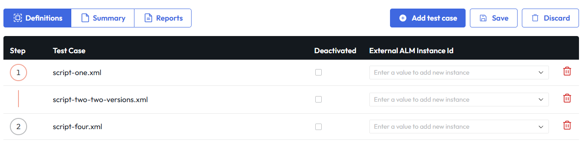
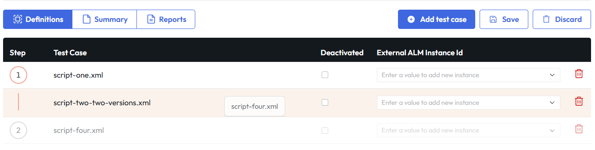
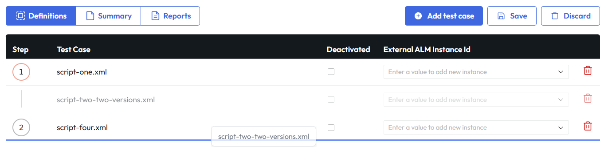
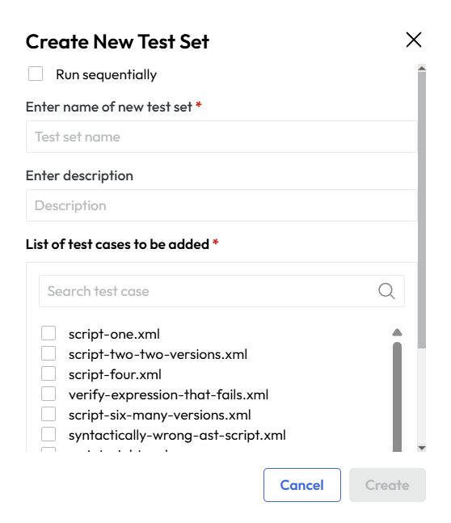
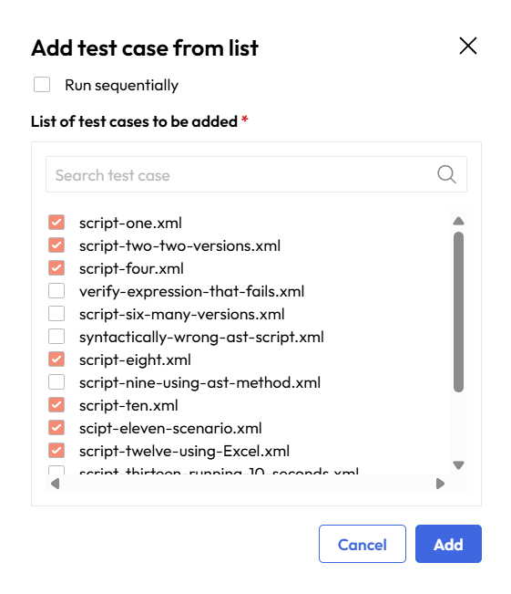
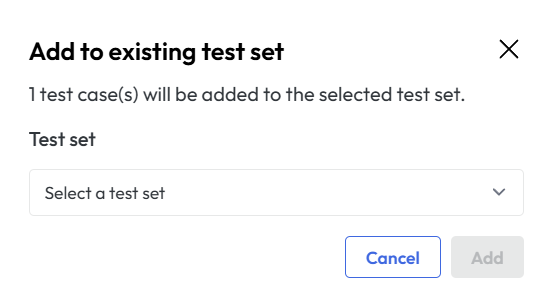

# Test Sets
The "Test Sets" menu on the AST Control Panel provides the organization of individual test cases into logical groups for streamlined, combined execution.

Menu has structure similar to test case repository, it is designed for efficiency, with the left side of the screen displaying a repository tree view of all available test sets. 
This whole menu is collapsible, so you can hide the tree view and use whole screen for content area if you want to focus on details of specific test set.

Selecting an item from this tree populates the main content area with detailed information and options for that particular test set.

<figcaption>Screenshot of the Test Sets screen showing a list of organized test suites.</figcaption>

It is possible also to filter the test sets. The results are loaded whilst you type characters one by one. Use refresh button if you feel like tree isn't properly loaded.

### Context menu
An important feature of this menu is the context menu, which appears when a user clicks on the three dots next to the test set in the repository tree. This menu offers several actions for managing the selected set.

<figcaption>Display of the context menu</figcaption>

| Action               |Description|
|----------------------|---|
| Modify Test Set Info |Allows user to change the name|
| Schedule             |Allows the user to Schedule a test case|
| Execute Now          |Immediate execution of test set|
| Delete Test Set      |Deletes test set|

The primary content area is divided into two key sections. At the top, a metadata panel displays the Name, Description, and unique Test Set ID. This provides quick, high-level context about the selected set. Below this, a tabbed interface further organizes the information. 

<figcaption>Screenshot of the Test Set detail panel, listing contained test cases and execution controls.</figcaption>>

#### Definitions tab
The Definitions tab shown in the previous  image, lists all the individual test cases included in the test set. For each test case, it displays its name, execution sequence, and whether it is Deactivated.
This organized table gives the user a clear view of which tests are part of the set and their execution order.

Sequence can be parallel or sequential. In parallel execution, all test cases are executed simultaneously, while in sequential execution, test cases are executed one after the other in a specified order.
The image below shows that the two testcases are set to execute in parallel as in indicated by the line before the second testcase. 
The third testcase has a number next to it, which means that it will be executed after the first two testcases are finished.

<figcaption>Two test cases are in parallel the third is sequential</figcaption>>

To group testcases into parallel or sequential execution tou need to click the *Edit* button in the definitions tabs.
Then you can use drag and drop to change the order of test cases and to group them into parallel or sequential execution.

To set testcase to execute in parallel you click on it and drag it on the testcase you want to execute in parallel with.

<figcaption>Dropping a testcase to another to make them execute in parallel</figcaption>>

To set testcase to execute sequentially you click on it and drag it to the line between testcases until the line is highlighted. 
Then you drop it there, and it will be executed after the testcase above the line is finished.

<figcaption>Dropping a testcase after another to make them execute in sequence</figcaption>>

#### Summary tab
The Summary tab shown in image below allows us to select the instance on which selected test set was executed and date range for which we want to see the summary.
Summary works as overview. For more details check reports tab.

<figcaption>Summary tab content with displayed data for specific instance and date range</figcaption>>

#### Reports tab
The Reports tab contains whole table with many fields that can be set up for different view.

<figcaption>Reports display for selected test set</figcaption>>

The table is designed to provide a comprehensive overview of all scheduled and executed test runs, allowing users to track the history and outcomes of their test executions effectively.
The table columns organize data points to track the execution timeline and ownership. These include the Start Date, End Date, Scheduled Date, and Creation Date, allowing for tracking of initiation and completion times. 
Additional columns identify the User Name responsible for the run and the specific Test Set or test case that was executed. Each execution is uniquely identified by an Execution ID and has a specific Status, such as "Finished."

The table includes a summary of execution results, detailing the number of Tests:

- Passed

- Failed

- Errored

- Pending

This numerical breakdown offers an immediate status of the execution outcome. The right-most columns provide action options, including viewing Reports and controls to Modify or Delete a scheduled run.

A separate detail window, accessed by clicking the desired row, provides a focused view of a single execution. At the top, a summary displays the total number of tests run and the breakdown of passed, failed, error, and pending results. A "Summary HTML report" button is available for a full report generation.

<figcaption>Screenshot of the Test Case Reporting detail window with pass/fail summary and report format buttons.</figcaption>

Granular execution report detail. This modal window displays the results breakdown and provides links to retrieve various report formats for in-depth analysis. For more details on the report formats, see the [Reports](reports.md) section.

The window lists the individual Test Cases included in the run. For each case, the Status, Start time, and End time of its execution are listed. The Reports dropdown, offers access to the execution data for that specific test case in three distinct formats: HTML, Log, XML and Excel. This allows for granular review and data integration. The bottom of the window provides controls to Schedule the test run again or Close the report window.

### Test set creation and alterations

#### Add new test set
To create test set you can use the *Create Test Set* button in the Test Sets screen or you can use the *Create New* in the Tests screen.
Then a dialog will appear where you can set up the name, description and select test cases that will be part of this set.

<figcaption>Dialog for test set creation</figcaption>

You can also use the context menu for the [folders](test_case_repository.md#folder-context-menu) and [testcases](test_case_repository.md#test-case-context-menu) in the test case screen to create a new test set.
In this case the same dialog appears but with already preselected testcase or all testcases from a folder.

#### Add test cases to already existing test set
In the Test set view in a open test set you can click on the *Edit* button in the Definitions tab.
This will enable of editing of the test set. Then you click on the *Add test case* button which will open a dialog from which you can select a test case that will be added to this set.

It also shows all the testcases that are present in this set. You can also remove test cases from this set by unchecking them in the list.

<figcaption>Dialog for adding a test case</figcaption>

Another option is to use he context menu for the [folders](test_case_repository.md#folder-context-menu) and [testcases](test_case_repository.md#test-case-context-menu) in the test case screen.
Then you choose add to existing test set and then select the test set to which you want to add this test case or folder.

<figcaption>Dialog for adding test cases to existing set</figcaption>

### Scheduling and Executing Test Sets
If you want to execute test set immediately, you can select 'Execute now' from the definitions tab. This will run the test set on selected instance and show results in reports tab.

When clicking on the Schedule button a dialog will appear, allowing you to set up the parameters for scheduling the execution of the test set. You can select the specific test set and instance on which it will run, as well as the scheduled date and time for execution. 
Additionally, there are options to configure recurrence if you want the test set to run on a regular basis.

The interface consists of a detailed, scrollable table that functions as the central log for both scheduled and completed test runs, structured to provide a comprehensive record of execution history.

<figcaption> A modal dialog illustrating the "Schedule execution" interface, detailing parameters for test set execution including selection of test set and instance, scheduled date/time, and recurrence options.</figcaption>

You will be able to see the scheduled execution in the table in the [Schedule](executions.md) tab.
