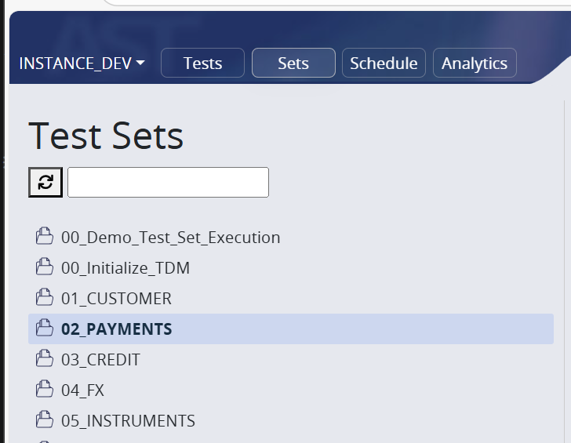
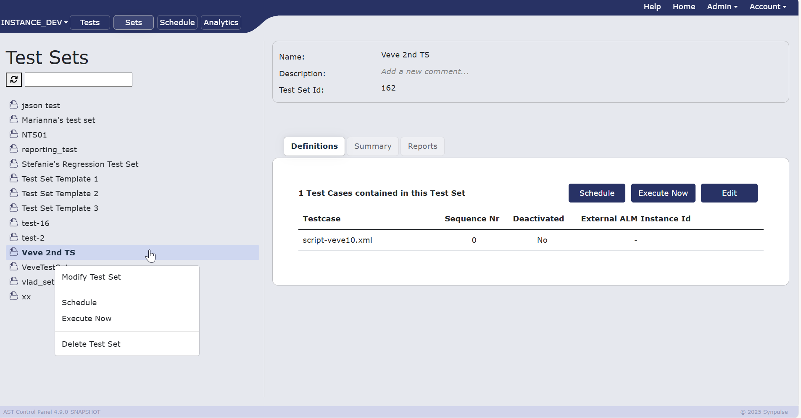
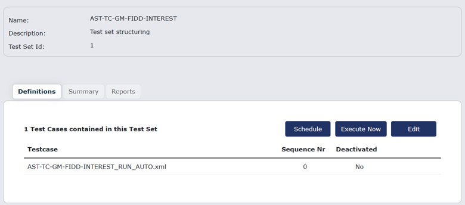
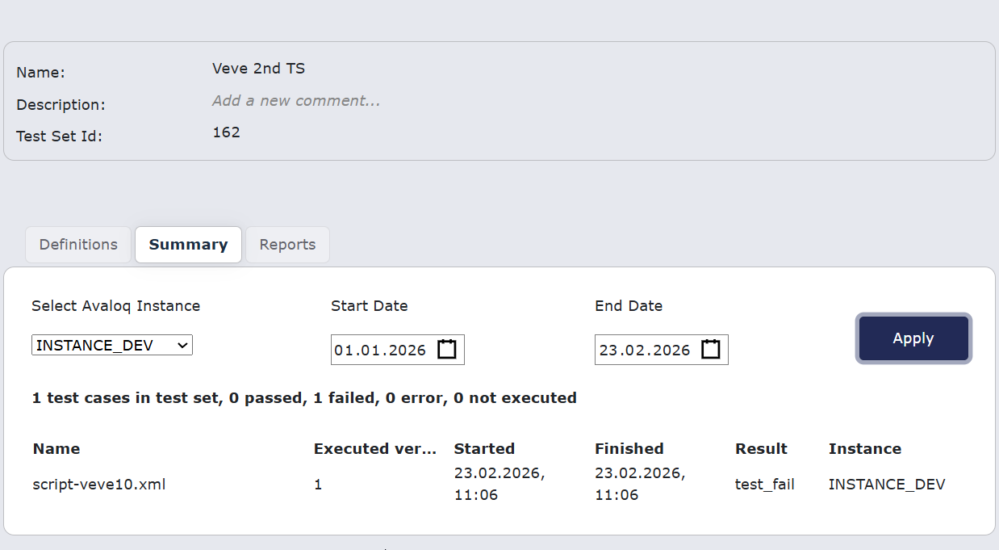
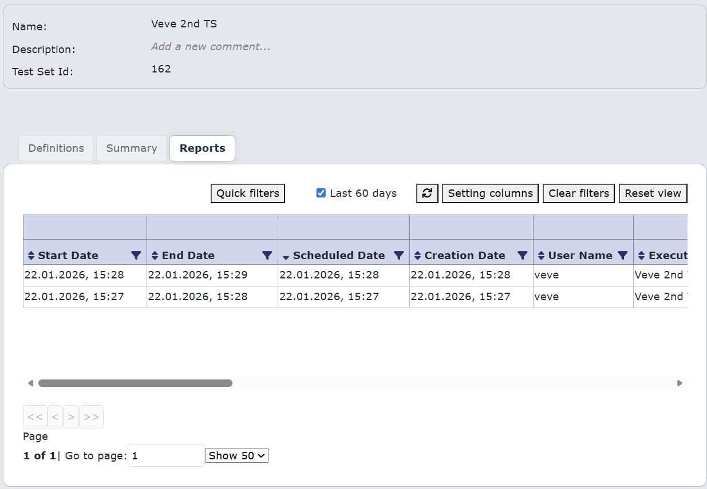
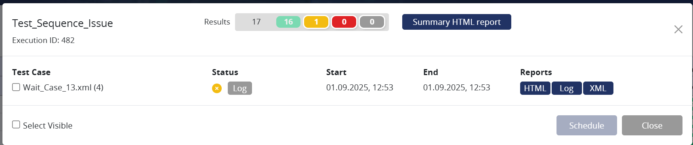
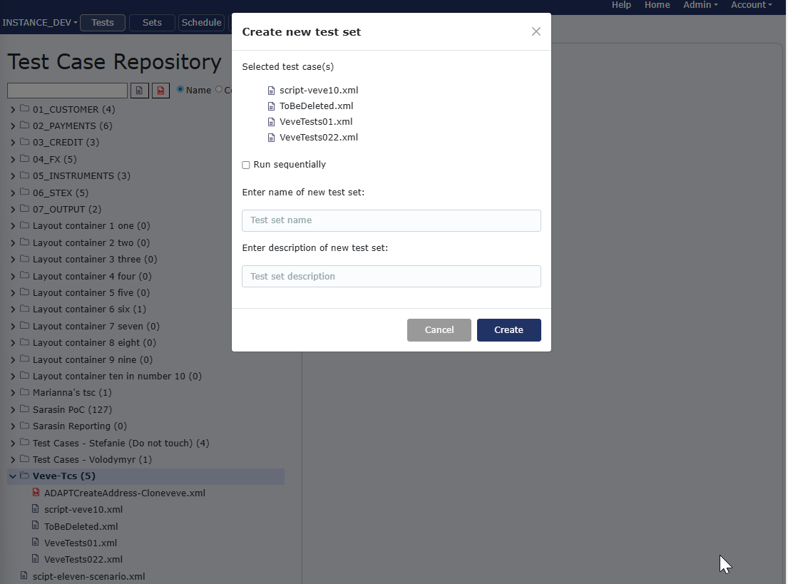
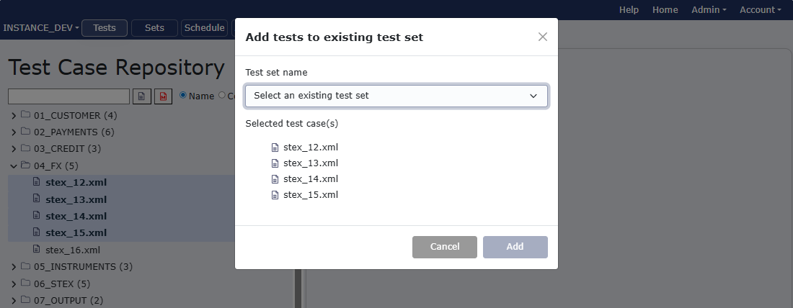
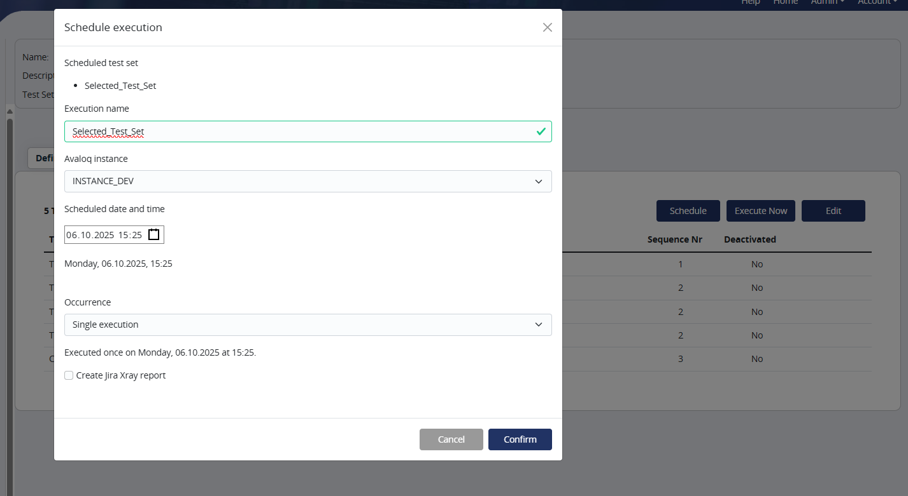

# Test Sets
The "Test Sets" menu on the AST Control Panel provides the organization of individual test cases into logical groups for streamlined, combined execution.

Menu has structure similar to test case repository, it is designed for efficiency, with the left side of the screen displaying a repository tree view of all available test sets. 
This list allows users to easily navigate and select a specific test set, such as "02_PAYMENTS" or "03_CREDIT." 

Selecting an item from this tree populates the main content area with detailed information and options for that particular test set.

<figcaption>Screenshot of the Test Sets screen showing a list of organized test suites.</figcaption>

It is possible also to filter the test sets. The results are loaded whilst you type characters one by one. Use refresh button if you feel like tree isn't properly loaded.

### Context menu
An important feature of this menu is the context menu, which appears when a user right-clicks on a test set in the repository tree. This menu offers several powerful actions for managing the selected set.

<figcaption>One of the sets was right-clicked to display the context menu</figcaption>

|Action|Description|
|---|---|
|Modify Test Set|Allows user to change the name|
|Schedule|Allows the user to Schedule a test case|
|Execute Now|Immediate execution of test set|
|Delete Test Set|Deletes test set|

The primary content area is divided into two key sections. At the top, a metadata panel displays the Name, Description, and unique Test Set ID. This provides quick, high-level context about the selected set. Below this, a tabbed interface further organizes the information. 

<figcaption>Screenshot of the Test Set detail panel, listing contained test cases and execution controls.</figcaption>>

#### Definitions tab
The Definitions tab shown in the previous  image, lists all the individual test cases included in the test set. For each test case, it displays its name, a Sequence Nr, and whether it is Deactivated.
This organized table gives the user a clear view of which tests are part of the set and their execution order.

#### Summary tab
The Summary tab shown in image below allows us to select the instance on which selected test set was executed and date range for which we want to see the summary.
Summary works as overview. For more details check reports tab.

<figcaption>Summary tab content with displayed data for specific instance and date range</figcaption>>

#### Reports tab
The Reports tab contains whole table with many fields that can be set up for different view.

<figcaption>Reports display for selected test set</figcaption>>

he table is designed to provide a comprehensive overview of all scheduled and executed test runs, allowing users to track the history and outcomes of their test executions effectively.
The table columns organize data points to track the execution timeline and ownership. These include the Start Date, End Date, Scheduled Date, and Creation Date, allowing for tracking of initiation and completion times. 
Additional columns identify the User Name responsible for the run and the specific Test Set or test case that was executed. Each execution is uniquely identified by an Execution ID and has a specific Status, such as "Finished."

The table includes a summary of execution results, detailing the number of Tests:
- Passed
- Failed
- Errored
- Pending

- This numerical breakdown offers an immediate status of the execution outcome. The right-most columns provide action options, including viewing Reports and controls to Modify or Delete a scheduled run.

A separate detail window, accessed via the report action, provides a focused view of a single execution. At the top, a summary displays the total number of tests run and the breakdown of passed, failed, error, and pending results. A "Summary HTML report" button is available for a full report generation.

<figcaption>Screenshot of the Test Case Reporting detail window with pass/fail summary and report format buttons.</figcaption>

Granular execution report detail. This modal window displays the results breakdown and provides links to retrieve various report formats for in-depth analysis. For more details on the report formats, see the [Reports](reports.md) section.

The window lists the individual Test Cases included in the run, such as "*Wait_Case_13.xml* (4)." For each case, the Status, Start time, and End time of its execution are listed. The final column, Reports, offers access to the execution data for that specific test case in three distinct formats: HTML, Log, and XML. This allows for granular review and data integration. The bottom of the window provides controls to Schedule the test run again or Close the report window.

### Test set creation and alterations

#### Add new test set
To create test set you have to select one or more test cases in 'Tests' tab or select folder, right click the selected item and choose from context menu to 'Create new test set',
You can create also test set from existing folder with test cases.

<figcaption>Create new test set from existing folder</figcaption>

#### Add test cases to already existing test set
There is also option to add test cases to already existing test set. 
Right click the test case or select multiple test cases you want to add and choose from context menu 'Add tests to existing test set.'
In drop down you can select one of existing sets that will be altered with this action.

<figcaption>Add multiple selected tests to existing set</figcaption>

There is always list of test cases that will be part of you future set and name and description. All of these can be also changed later in sets tab.

### Scheduling and Executing Test Sets
If you want to execute test set immediately, you can select 'Execute now' from context menu. This will run the test set on selected instance and show results in reports tab.

When clicking on the Schedule button a dialog will appear, allowing you to set up the parameters for scheduling the execution of the test set. You can select the specific test set and instance on which it will run, as well as the scheduled date and time for execution. Additionally, there are options to configure recurrence if you want the test set to run on a regular basis.

The interface consists of a detailed, scrollable table that functions as the central log for both scheduled and completed test runs, structured to provide a comprehensive record of execution history.

<figcaption> A modal dialog illustrating the "Schedule execution" interface, detailing parameters for test set execution including selection of test set and instance, scheduled date/time, and recurrence options.</figcaption>

You will be able to see the scheduled execution in the table in the [Schedule](schedule.md) tab.
